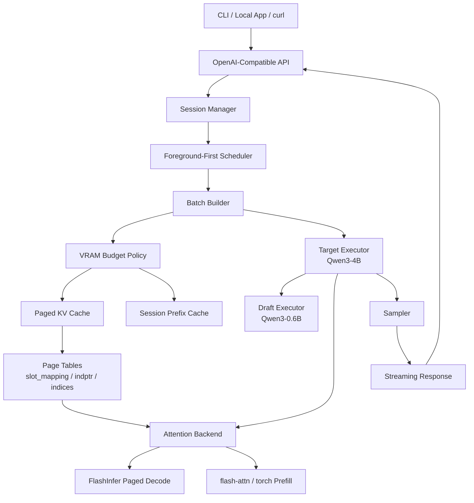
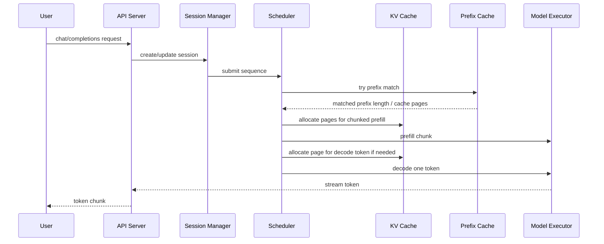
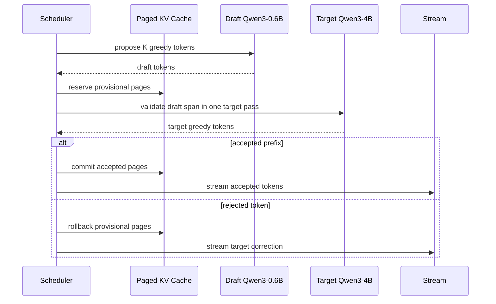

# SoloRT

**A single-user, single-GPU LLM inference runtime for consumer NVIDIA GPUs.**

SoloRT targets the local interactive workload that sits between a toy demo and a data-center
serving stack: one user, one consumer NVIDIA GPU, long-lived chat/code/RAG/agent sessions, and a
strong preference for low foreground latency over aggregate throughput.

中文定位：一個針對單張消費級 NVIDIA GPU、單使用者互動式場景設計的 LLM inference runtime。

## Design Goals

- Run well on a single RTX 4080-class 16 GB GPU.
- Optimize TTFT and inter-token latency for local interactive sessions.
- Keep long sessions alive under finite VRAM through paged KV cache and session prefix reuse.
- Prefer foreground decode over background prefill work.
- Start as a Python MVP, then replace hot paths with C++/CUDA kernels behind stable interfaces.

Non-goals for the first version:

- Multi-user high-throughput serving.
- Multi-GPU tensor parallelism.
- Prefill/decode disaggregation.
- Full model zoo support.
- First-party FlashAttention replacement on day one.
- Multimodal request execution in the MVP.

## Architecture



The default real-model serving target is `Qwen/Qwen3-4B` with `Qwen/Qwen3-0.6B` as the greedy
speculative draft model. The current executor is a Transformers bridge: SoloRT owns scheduling,
page metadata, prefix-cache policy, and speculative metrics, while Hugging Face still executes the
Qwen layers until the custom paged layer runner replaces that boundary.

## Request Lifecycle



## Speculative Decode Flow



## Runtime Status

SoloRT's real-model path uses Hugging Face Transformers with an explicit serving loop:

1. the scheduler chunks prefill work;
2. the executor feeds each prompt chunk into the model and accumulates `past_key_values`;
3. decode runs one token at a time;
4. the API streams each token through OpenAI-style SSE events.

The FlashInfer-facing cache metadata is now produced by SoloRT. The next executor milestone is to
replace the Transformers `past_key_values` bridge with a Qwen layer runner that writes directly into
SoloRT's tensor-backed paged KV cache.

- `POST /v1/chat/completions` with OpenAI-style request/response shapes.
- Streaming and non-streaming completions.
- Session-bound sequences.
- Foreground-first scheduler with chunked prefill and one-token decode.
- In-memory paged KV page allocator.
- Session-aware block-hash prefix cache.
- Replaceable executor, sampler, and attention backend interfaces.

## First Real Model Target

The primary real-model target is `Qwen/Qwen3-4B`, used with `Qwen/Qwen3-0.6B` as the default
speculative draft model. SoloRT defaults Qwen thinking mode off for the fast local-chat path.

The current executor keeps Qwen layer assembly in Transformers while routing attention through the
SoloRT FlashInfer bridge. The full tensor-backed paged-KV executor remains the long-term runtime
path.

References:

- [Qwen/Qwen3-4B model card](https://huggingface.co/Qwen/Qwen3-4B)
- [Qwen/Qwen3-0.6B model card](https://huggingface.co/Qwen/Qwen3-0.6B)
- [Qwen3 collection](https://huggingface.co/collections/Qwen/qwen3-67dd247413f0e2e4f653967f)
- [SoloRT architecture notes](docs/architecture.md)

## Running Other Models

SoloRT is model-agnostic: the executor serves whatever Hugging Face causal LM you point it at, and
the paged KV layout is derived from the model config (layers, KV heads, head dim). Pick models with
environment variables or the generic Makefile target — no code changes required.

```bash
# Any HF causal LM as the target, with a same-family speculative draft.
make docker-ngc-up-model \
  MODEL=meta-llama/Llama-3.2-3B-Instruct \
  DRAFT_MODEL=meta-llama/Llama-3.2-1B-Instruct

# Single model, speculation disabled.
make docker-ngc-up-model MODEL=mistralai/Mistral-7B-Instruct-v0.3 DRAFT_MODEL= SPEC_TOKENS=0

# Architecture the FlashInfer bridge does not model exactly -> let Transformers do attention.
make docker-ngc-up-model MODEL=google/gemma-2-2b-it DRAFT_MODEL= SPEC_TOKENS=0 ATTENTION_BACKEND=sdpa
```

The generic knobs map to these environment variables:

| Variable | Purpose |
| --- | --- |
| `SOLORT_MODEL_ID` | Target model repo id. |
| `SOLORT_SPECULATIVE_DRAFT_MODEL_ID` | Draft model; leave empty to disable speculation. |
| `SOLORT_SPECULATIVE_TOKENS` | Draft length `K` (`0` disables speculation). |
| `SOLORT_ATTENTION_BACKEND` | `flashinfer` (default), `sdpa`, `eager`, `flash_attention_2`. |
| `SOLORT_TRUST_REMOTE_CODE` | Set `1` for models that ship custom modeling code. |

Constraints to know:

- **Speculative decoding needs a shared tokenizer/vocab** between draft and target — SoloRT compares
  token ids directly. A vocab-size mismatch is detected at load time and speculation is disabled with
  a warning, so output stays correct. Pair models from one family (Qwen3-4B + Qwen3-0.6B,
  Llama-3.x 3B + 1B, ...).
- The FlashInfer bridge implements standard scaled-dot-product attention with GQA and sliding
  windows. Architectures that need extra attention math (Gemma2 logit soft-capping, DeepSeek MLA)
  should run with `ATTENTION_BACKEND=sdpa` so Transformers computes attention exactly.
- VRAM is the practical ceiling: a 16 GB card comfortably runs a ~4B target + ~0.6B draft in fp16.
- Prefetch weights once with `make docker-hf-prefetch MODEL=... DRAFT_MODEL=...`.

## Development Checks

Install local development dependencies when working outside Docker:

```bash
python -m pip install -e ".[dev]"
```

Run checks:

```bash
pytest
ruff check .
```

The same checks are available in Docker:

```bash
make docker-test
make docker-lint
```

## Serving Quick Start

Build the NGC image, prefetch the model weights, then start the GPU server:

```bash
make docker-ngc-build
make docker-hf-prefetch
make docker-ngc-up
```

In a second terminal, send a streaming request:

```bash
curl -N http://127.0.0.1:8000/v1/chat/completions \
  -H 'content-type: application/json' \
  -d '{
    "model": "Qwen/Qwen3-4B",
    "stream": true,
    "messages": [{"role": "user", "content": "用繁體中文簡短介紹 SoloRT。"}],
    "max_tokens": 128,
    "temperature": 0
  }'
```

For a cleaner terminal chat view:

```bash
PYTHONPATH=src python -m solort.cli \
  --url http://127.0.0.1:8000 \
  --model Qwen/Qwen3-4B \
  --session-id chat-test \
  --temperature 0
```

### Docker Qwen3-4B + 0.6B Speculative Path

Preferred GPU path: build from the NVIDIA NGC PyTorch container:

```bash
make docker-ngc-build
make docker-ngc-up
```

Probe GPU visibility inside the NGC image:

```bash
make docker-ngc-probe
```

This uses [Dockerfile.ngc](Dockerfile.ngc), based on `nvcr.io/nvidia/pytorch:24.07-py3`, and runs
with the NVIDIA-recommended container flags: `--gpus all`, `--ipc=host`, `--ulimit memlock=-1`, and
`--ulimit stack=67108864`.

Alternative non-NGC build:

```bash
make docker-llm-build
```

Start the Qwen3 API:

```bash
make docker-llm-up
```

The default NGC target runs `Qwen/Qwen3-4B` as the target model and `Qwen/Qwen3-0.6B` as the
draft model for greedy speculative decoding:

```bash
make docker-ngc-build
make docker-ngc-up-qwen4b
```

On an RTX 4080 16 GB-class card, use the GPU path; CPU serving for 4B is intentionally not wired as
a default target because it is not practical for interactive chat.

You can also override the model on any NGC target:

```bash
make docker-ngc-up QWEN4B_MODEL=Qwen/Qwen3-4B QWEN06B_MODEL=Qwen/Qwen3-0.6B
```

The first startup downloads both Qwen models into `~/.cache/huggingface`, which is mounted into the
container so later runs can reuse the weights. The default runtime environment is:

```text
SOLORT_EXECUTOR=paged
SOLORT_MODEL_ID=Qwen/Qwen3-4B
SOLORT_SPECULATIVE_DRAFT_MODEL_ID=Qwen/Qwen3-0.6B
SOLORT_SPECULATIVE_TOKENS=4
SOLORT_ATTENTION_BACKEND=flashinfer
SOLORT_ENABLE_THINKING=0
```

`SOLORT_ATTENTION_BACKEND=flashinfer` registers a Hugging Face attention bridge named
`solort_flashinfer`. Qwen3 layers are still assembled by Transformers, but their dense prefill and
decode attention calls dispatch to FlashInfer kernels. The tensor-backed paged-KV runner remains the
next milestone.

To avoid waiting during server startup, prefetch the target and draft models once:

```bash
make docker-ngc-build
make docker-hf-prefetch
```

All Docker LLM targets mount the same host cache by default:

```text
HF_HOME=$HOME/.cache/huggingface
container path=/root/.cache/huggingface
```

If you want the cache somewhere else, pass one path consistently:

```bash
make docker-hf-prefetch HF_HOME=/data/hf-cache
make docker-ngc-up HF_HOME=/data/hf-cache
```

Speculative decoding is available for deterministic decoding (`temperature=0`) when a draft model
is configured:

```bash
docker run --rm --gpus all --ipc=host \
  --ulimit memlock=-1 --ulimit stack=67108864 \
  --name solort-api-ngc-spec -p 8000:8000 \
  -e SOLORT_EXECUTOR=paged \
  -e SOLORT_MODEL_ID=Qwen/Qwen3-4B \
  -e SOLORT_SPECULATIVE_DRAFT_MODEL_ID=Qwen/Qwen3-0.6B \
  -e SOLORT_SPECULATIVE_TOKENS=4 \
  -e SOLORT_ENABLE_THINKING=0 \
  -e HF_HOME=/root/.cache/huggingface \
  -v "$HOME/.cache/huggingface:/root/.cache/huggingface" \
  solort:qwen3-4b-spec-ngc
```

Speculative counters are exposed from `/metrics` under `executor_stats`.

The LLM image installs the PyTorch CUDA 12.6 wheel by default because this project targets consumer
NVIDIA machines where the host driver may not support CUDA 13 yet. Override at build time if needed:

```bash
docker build --target llm -t solort:qwen3-4b-spec \
  --build-arg TORCH_INDEX_URL=https://download.pytorch.org/whl/cu128 .
```

Then call the same OpenAI-style endpoint:

```bash
curl -s http://127.0.0.1:8000/v1/chat/completions \
  -H 'content-type: application/json' \
  -d '{
    "model": "Qwen/Qwen3-4B",
    "messages": [{"role": "user", "content": "Give me a short SoloRT status update."}],
    "max_tokens": 64,
    "temperature": 0.7,
    "top_p": 0.8,
    "top_k": 20,
    "enable_thinking": false
  }'
```

On a CPU-only host this model is not practical for interactive chat. For a CUDA path, use the GPU profile or run
the image with NVIDIA Container Toolkit enabled.

To compare GPU and CPU serving latency, start one GPU endpoint on `8000` and one CPU endpoint on
`8001` in separate terminals:

```bash
make docker-ngc-up
make docker-ngc-up-cpu
```

Then run the streaming benchmark:

```bash
python benchmarks/bench_serving.py \
  --case gpu=http://127.0.0.1:8000 \
  --case cpu=http://127.0.0.1:8001 \
  --max-tokens 32 \
  --warmup 1 \
  --runs 3
```

`TTFT` is measured at the first non-empty streamed token. `TTOT` is measured when the final
`data: [DONE]` marker arrives.

If the Docker Compose plugin is installed, the equivalent Compose path is:

```bash
docker compose up --build solort
docker compose --profile test run --rm test
docker compose --profile lint run --rm lint
```

An experimental `gpu` Compose profile is included for the Qwen3 real-model path:

```bash
docker compose --profile gpu up --build solort-gpu
```

The GPU profile assumes the NVIDIA Container Toolkit is installed on the host.

## Roadmap

Phase 1: Python-only MVP

- Single-user OpenAI-compatible API.
- Session manager and foreground-first scheduler.
- Chunked prefill/decode split.
- Paged KV metadata and block-hash prefix cache.
- Qwen3 Transformers executor with the SoloRT FlashInfer attention bridge.

Phase 2: Python + CUDA kernels

- RMSNorm.
- RoPE.
- `store_kv_cache`.
- Greedy/top-k sampling.
- KV quant/dequant.

Phase 3: Runtime core replacement

- C++ page allocator and metadata packing.
- C++ model executor hot path.
- Optional scheduler hot path if profiling says it matters.

Phase 4: Consumer-GPU decode attention

- Replace the FlashInfer decode backend with a custom paged decode attention kernel optimized for
  batch-1 and small-batch local interactive workloads.

## Benchmarks

Implemented benchmark surface:

- `benchmarks/bench_serving.py`: compares one or more streaming endpoints, including CPU and GPU
  SoloRT containers, and reports TTFT/TTOT.

Planned benchmark surfaces:

- Single-turn chat latency: TTFT, average TPOT, p95 inter-token latency.
- Long session growth: page usage, prefix hit rate, latency drift.
- Foreground/background interference: foreground TTFT while background prefill is active.
- Mixed precision KV policy: max context, latency, and output drift.
