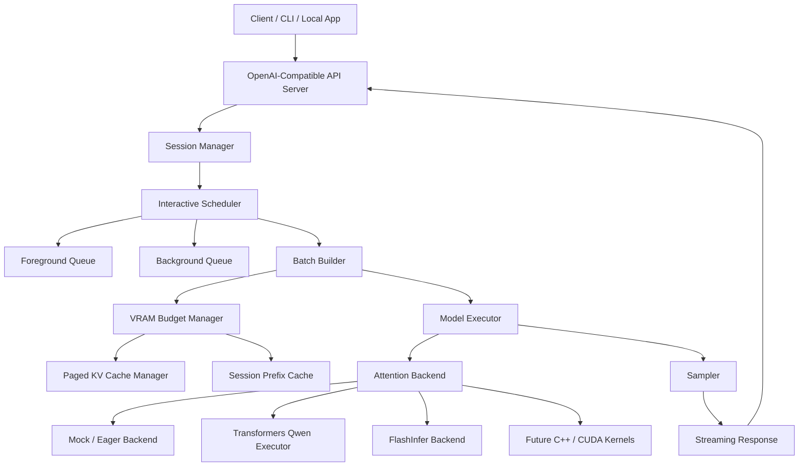
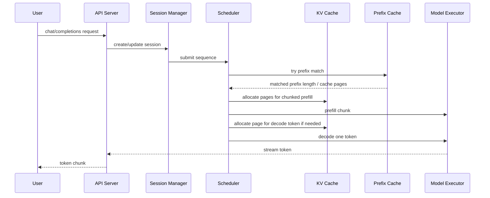

# SoloRT

**A single-user, single-GPU LLM inference runtime for consumer NVIDIA GPUs.**

SoloRT targets the local interactive workload that sits between a toy demo and a data-center
serving stack: one user, one consumer NVIDIA GPU, long-lived chat/code/RAG/agent sessions, and a
strong preference for low foreground latency over aggregate throughput.

中文定位：一個針對單張消費級 NVIDIA GPU、單使用者互動式場景設計的 LLM inference runtime。

## Design Goals

- Run well on a single RTX 4080-class 16 GB GPU.
- Optimize TTFT and inter-token latency for local interactive sessions.
- Keep long sessions alive under finite VRAM through paged KV cache and session prefix reuse.
- Prefer foreground decode over background prefill work.
- Start as a Python MVP, then replace hot paths with C++/CUDA kernels behind stable interfaces.

Non-goals for the first version:

- Multi-user high-throughput serving.
- Multi-GPU tensor parallelism.
- Prefill/decode disaggregation.
- Full model zoo support.
- First-party FlashAttention replacement on day one.
- Multimodal request execution in the MVP.

## Architecture



## Request Lifecycle



## Runtime Status

This repository contains both a lightweight mock executor for unit tests and a real text-serving
executor for `Qwen/Qwen3-0.6B`. The real-model path uses Hugging Face Transformers with an explicit
serving loop:

1. the scheduler chunks prefill work;
2. the executor feeds each prompt chunk into the model and accumulates `past_key_values`;
3. decode runs one token at a time;
4. the API streams each token through OpenAI-style SSE events.

The future FlashInfer/CUDA path will replace the cache and attention internals behind the same
API-facing shape.

- `POST /v1/chat/completions` with OpenAI-style request/response shapes.
- Streaming and non-streaming completions.
- Session-bound sequences.
- Foreground-first scheduler with chunked prefill and one-token decode.
- In-memory paged KV page allocator.
- Session-aware block-hash prefix cache.
- Replaceable executor, sampler, and attention backend interfaces.

## First Real Model Target

The first enabled real-model target is `Qwen/Qwen3-0.6B`, used through a Hugging Face
Transformers executor. The Qwen model card lists it as a 0.6B causal language model with 28 layers,
GQA attention, a 32K context length, Apache-2.0 licensing, and support for switching Qwen3 thinking
mode on or off. SoloRT defaults thinking mode off for the fast local-chat path.

This Transformers executor is intentionally small and readable: it proves the OpenAI-compatible API,
session manager, foreground scheduler, prefill phase, decode phase, and streaming path with a real
small LLM, while the paged-KV/FlashInfer/CUDA executor remains the long-term runtime path.

References:

- [Qwen/Qwen3-0.6B model card](https://huggingface.co/Qwen/Qwen3-0.6B)
- [Qwen3 collection](https://huggingface.co/collections/Qwen/qwen3-67dd247413f0e2e4f653967f)

## Quick Start

Install in editable mode:

```bash
python -m pip install -e ".[dev]"
```

Run the mock API:

```bash
uvicorn solort.api.server:create_app --factory --reload
```

Send a non-streaming request:

```bash
curl -s http://127.0.0.1:8000/v1/chat/completions \
  -H 'content-type: application/json' \
  -d '{
    "model": "Qwen/Qwen3-0.6B",
    "messages": [{"role": "user", "content": "Explain SoloRT in one sentence."}],
    "max_tokens": 8
  }'
```

Send a streaming request:

```bash
curl -N http://127.0.0.1:8000/v1/chat/completions \
  -H 'content-type: application/json' \
  -d '{
    "model": "Qwen/Qwen3-0.6B",
    "stream": true,
    "messages": [{"role": "user", "content": "Stream a tiny mock answer."}],
    "max_tokens": 8
  }'
```

For a cleaner terminal chat view that prints only assistant text, use the built-in client:

```bash
PYTHONPATH=src python -m solort.cli \
  --session-id chat-test \
  "我剛剛說的專案代號是什麼？請只回答代號。"
```

Or start an interactive session:

```bash
PYTHONPATH=src python -m solort.cli --session-id chat-test
```

Run checks:

```bash
pytest
ruff check .
```

## Docker Quick Start

The default Docker path runs the mock MVP API. It does not require a GPU or model weights.

Build the dev image:

```bash
docker build --target dev -t solort:dev .
```

Start the API:

```bash
docker run --rm --name solort-api -p 8000:8000 \
  -v "$PWD/src:/app/src" \
  -v "$PWD/tests:/app/tests" \
  -v "$PWD/benchmarks:/app/benchmarks" \
  -v "$PWD/README.md:/app/README.md" \
  -v "$PWD/pyproject.toml:/app/pyproject.toml" \
  solort:dev
```

Open the health endpoint:

```bash
curl http://127.0.0.1:8000/health
```

Send a local chat completion:

```bash
curl -s http://127.0.0.1:8000/v1/chat/completions \
  -H 'content-type: application/json' \
  -d '{
    "model": "Qwen/Qwen3-0.6B",
    "messages": [{"role": "user", "content": "Explain SoloRT in one sentence."}],
    "max_tokens": 8
  }'
```

Run tests and lint inside Docker:

```bash
docker run --rm \
  -v "$PWD/src:/app/src" \
  -v "$PWD/tests:/app/tests" \
  -v "$PWD/benchmarks:/app/benchmarks" \
  -v "$PWD/README.md:/app/README.md" \
  -v "$PWD/pyproject.toml:/app/pyproject.toml" \
  solort:dev pytest

docker run --rm \
  -v "$PWD/src:/app/src" \
  -v "$PWD/tests:/app/tests" \
  -v "$PWD/benchmarks:/app/benchmarks" \
  -v "$PWD/README.md:/app/README.md" \
  -v "$PWD/pyproject.toml:/app/pyproject.toml" \
  solort:dev ruff check .
```

Useful make targets are also available:

```bash
make docker-up
make docker-test
make docker-lint
```

### Docker Qwen3-0.6B Path

Preferred GPU path: build from the NVIDIA NGC PyTorch container:

```bash
make docker-ngc-build
make docker-ngc-up
```

Probe GPU visibility inside the NGC image:

```bash
make docker-ngc-probe
```

This uses [Dockerfile.ngc](Dockerfile.ngc), based on `nvcr.io/nvidia/pytorch:24.07-py3`, and runs
with the NVIDIA-recommended container flags: `--gpus all`, `--ipc=host`, `--ulimit memlock=-1`, and
`--ulimit stack=67108864`.

Alternative non-NGC build:

```bash
make docker-llm-build
```

Start the Qwen3 API:

```bash
make docker-llm-up
```

To run the larger Qwen3 4B model on the NGC GPU path:

```bash
make docker-ngc-build
make docker-ngc-up-qwen4b
```

This uses `Qwen/Qwen3-4B` through the same Transformers executor. On an RTX 4080 16 GB-class card,
use the GPU path; CPU serving for 4B is intentionally not wired as a default target because it is
not practical for interactive chat.

You can also override the model on any NGC target:

```bash
make docker-ngc-up QWEN06B_MODEL=Qwen/Qwen3-4B
```

The first startup downloads `Qwen/Qwen3-0.6B` into `~/.cache/huggingface`, which is mounted into the
container so later runs can reuse the weights. The default runtime environment is:

```text
SOLORT_EXECUTOR=transformers
SOLORT_MODEL_ID=Qwen/Qwen3-0.6B
SOLORT_ENABLE_THINKING=0
```

Speculative decoding is available for deterministic decoding (`temperature=0`) when a draft model
is configured:

```bash
docker run --rm --gpus all --ipc=host \
  --ulimit memlock=-1 --ulimit stack=67108864 \
  --name solort-api-ngc-spec -p 8000:8000 \
  -e SOLORT_EXECUTOR=transformers \
  -e SOLORT_MODEL_ID=Qwen/Qwen3-0.6B \
  -e SOLORT_SPECULATIVE_DRAFT_MODEL_ID=Qwen/Qwen3-0.6B \
  -e SOLORT_SPECULATIVE_TOKENS=4 \
  -e SOLORT_ENABLE_THINKING=0 \
  -v /tmp/solort-hf-cache:/root/.cache/huggingface \
  solort:qwen3-0.6b-ngc
```

Using the same model as the draft is useful as a correctness check, but it is usually not faster.
Real speedup requires a smaller draft model with a compatible tokenizer. Speculative counters are
exposed from `/metrics` under `executor_stats`.

The LLM image installs the PyTorch CUDA 12.6 wheel by default because this project targets consumer
NVIDIA machines where the host driver may not support CUDA 13 yet. Override at build time if needed:

```bash
docker build --target llm -t solort:qwen3-0.6b \
  --build-arg TORCH_INDEX_URL=https://download.pytorch.org/whl/cu128 .
```

Then call the same OpenAI-style endpoint:

```bash
curl -s http://127.0.0.1:8000/v1/chat/completions \
  -H 'content-type: application/json' \
  -d '{
    "model": "Qwen/Qwen3-0.6B",
    "messages": [{"role": "user", "content": "Give me a short SoloRT status update."}],
    "max_tokens": 64,
    "temperature": 0.7,
    "top_p": 0.8,
    "top_k": 20,
    "enable_thinking": false
  }'
```

On a CPU-only host this small model can still be slow. For a CUDA path, use the GPU profile or run
the image with NVIDIA Container Toolkit enabled.

To compare GPU and CPU serving latency, start one GPU endpoint on `8000` and one CPU endpoint on
`8001` in separate terminals:

```bash
make docker-ngc-up
make docker-ngc-up-cpu
```

Then run the streaming benchmark:

```bash
python benchmarks/bench_serving.py \
  --case gpu=http://127.0.0.1:8000 \
  --case cpu=http://127.0.0.1:8001 \
  --max-tokens 32 \
  --warmup 1 \
  --runs 3
```

`TTFT` is measured at the first non-empty streamed token. `TTOT` is measured when the final
`data: [DONE]` marker arrives.

If the Docker Compose plugin is installed, the equivalent Compose path is:

```bash
docker compose up --build solort
docker compose --profile test run --rm test
docker compose --profile lint run --rm lint
```

An experimental `gpu` Compose profile is included for the Qwen3 real-model path:

```bash
docker compose --profile gpu up --build solort-gpu
```

The GPU profile assumes the NVIDIA Container Toolkit is installed on the host.

## Roadmap

Phase 1: Python-only MVP

- Single-user OpenAI-compatible API.
- Session manager and foreground-first scheduler.
- Chunked prefill/decode split.
- Paged KV metadata and block-hash prefix cache.
- Mock executor for tests and Qwen3 Transformers executor for real local serving.

Phase 2: Python + CUDA kernels

- RMSNorm.
- RoPE.
- `store_kv_cache`.
- Greedy/top-k sampling.
- KV quant/dequant.

Phase 3: Runtime core replacement

- C++ page allocator and metadata packing.
- C++ model executor hot path.
- Optional scheduler hot path if profiling says it matters.

Phase 4: Consumer-GPU decode attention

- Replace the FlashInfer decode backend with a custom paged decode attention kernel optimized for
  batch-1 and small-batch local interactive workloads.

## Benchmarks

Implemented benchmark surface:

- `benchmarks/bench_serving.py`: compares one or more streaming endpoints, including CPU and GPU
  SoloRT containers, and reports TTFT/TTOT.

Planned benchmark surfaces:

- Single-turn chat latency: TTFT, average TPOT, p95 inter-token latency.
- Long session growth: page usage, prefix hit rate, latency drift.
- Foreground/background interference: foreground TTFT while background prefill is active.
- Mixed precision KV policy: max context, latency, and output drift.
