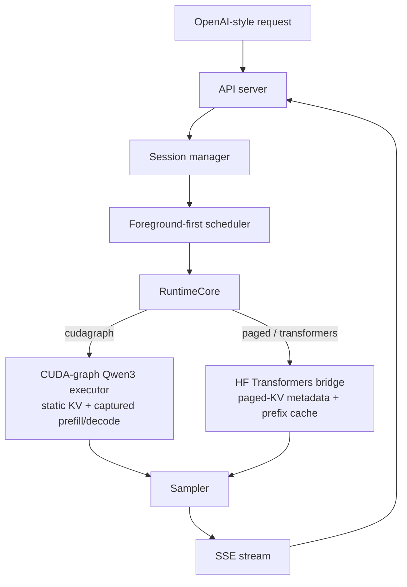

<!-- LANG-LINKS -->
**English** · [繁體中文](README.zh-TW.md)

# SoloRT

**A single-user, single-GPU LLM inference runtime for consumer NVIDIA GPUs — tuned for one
interactive session, and faster than vLLM on that workload.**

SoloRT targets the local interactive workload between a toy demo and a data-center serving stack:
one user, one consumer NVIDIA GPU, long-lived chat/code/RAG/agent sessions, and a strong preference
for low foreground latency over aggregate throughput.

## Performance

Single-stream, greedy, exact, RTX 4080 16 GB, Qwen3, vs vLLM v0.8.5 (`SOLORT_EXECUTOR=cudagraph`):

| model      | SoloRT decode | vLLM decode | SoloRT TTFT | vLLM TTFT |
| ---------- | ------------- | ----------- | ----------- | --------- |
| Qwen3-0.6B | ~150-180 tok/s (**1.6-2.0×**) | 91 tok/s | ~12 ms (**win**) | 22 ms |
| Qwen3-4B   | ~67 tok/s (**1.21×**)         | 56 tok/s | ~27 ms (**win**) | 30 ms |

SoloRT beats vLLM on both decode throughput and time-to-first-token, for both models, with
bit-for-bit greedy-equivalent output — up from a ~11 tok/s HuggingFace-eager baseline. Method and
the full optimization history are in [records.md](records.md) and [docs/devlog.md](docs/devlog.md).

## How it gets there

The interactive batch-1 decode is **kernel-launch / weight-memory bound**, not compute bound. The
fast path (`cudagraph` executor) is a hand-written, graph-friendly Qwen3 forward over SoloRT-owned
static KV:

- **CUDA graphs** for both prefill and the single-token decode (bucketed by length, so attention
  scans only the live tokens) — eliminates per-token kernel-launch overhead.
- **On-GPU greedy argmax** inside the graph (no eager argmax over the 151,936-token vocab).
- **Grouped-query attention without KV materialization** (no `repeat_interleave`).
- **Fused QKV / gate-up GEMMs** and **incremental detokenization**.

## Quick Start

Build the NGC GPU image and prefetch the weights once:

```bash
make docker-ngc-build
make docker-hf-prefetch
```

Run the fast CUDA-graph path (Qwen3 + CUDA):

```bash
docker run --rm --gpus all --ipc=host --ulimit memlock=-1 --ulimit stack=67108864 \
  -p 8000:8000 \
  -e SOLORT_EXECUTOR=cudagraph -e SOLORT_MODEL_ID=Qwen/Qwen3-4B \
  -e SOLORT_GRAPH_MAX_LEN=1024 -e SOLORT_ENABLE_THINKING=0 \
  -v "$HOME/.cache/huggingface":/root/.cache/huggingface \
  solort:qwen3-4b-spec-ngc
```

Then call the OpenAI-style endpoint:

```bash
curl -N http://127.0.0.1:8000/v1/chat/completions \
  -H 'content-type: application/json' \
  -d '{"model":"Qwen/Qwen3-4B","stream":true,
       "messages":[{"role":"user","content":"用繁體中文簡短介紹 SoloRT。"}],
       "max_tokens":128,"temperature":0}'
```

## Executors

`SOLORT_EXECUTOR` selects the runtime:

| value | description |
| ----- | ----------- |
| `cudagraph` | **Fast path.** Custom CUDA-graph Qwen3 forward. Single active sequence (the single-user target), Qwen3-family + CUDA only, exact greedy. Beats vLLM single-stream. |
| `paged` (default) | General HuggingFace-Transformers bridge with SoloRT scheduling, paged-KV metadata, prefix cache, and a FlashInfer attention option. Works for any HF causal LM. |
| `transformers` | Same HF bridge with `attention_backend=auto`. |

`SOLORT_GRAPH_MAX_LEN` bounds prompt+generation for the cudagraph static KV (default 1024; larger
costs memory locality). `SOLORT_DECODE_CHUNK=K` (default 4) emits K greedy tokens per decode step,
pipelined on the GPU stream with one CPU sync, to amortize the fixed per-step Python (+7% on 0.6B,
neutral on 4B; exact greedy). `SOLORT_SPECULATIVE_TOKENS=K` adds an exact graphed-draft speculative
path (0.6B draft → 4B target); after the on-GPU argmax it no longer beats the target-only cudagraph.

## Running Other Models

The runtime is model-agnostic — pick a model via environment variables or the generic Make target:

```bash
# Any HF causal LM (general `paged` path), with a same-family speculative draft.
make docker-ngc-up-model \
  MODEL=meta-llama/Llama-3.2-3B-Instruct DRAFT_MODEL=meta-llama/Llama-3.2-1B-Instruct

# Architecture the FlashInfer bridge does not model exactly -> let Transformers do attention.
make docker-ngc-up-model MODEL=google/gemma-2-2b-it DRAFT_MODEL= SPEC_TOKENS=0 ATTENTION_BACKEND=sdpa
```

| Variable | Purpose |
| --- | --- |
| `SOLORT_MODEL_ID` | Target model repo id. |
| `SOLORT_SPECULATIVE_DRAFT_MODEL_ID` / `SOLORT_SPECULATIVE_TOKENS` | Draft model + length `K` (`0` disables). |
| `SOLORT_ATTENTION_BACKEND` | `flashinfer` / `sdpa` / `eager` / `flash_attention_2` (HF path). |
| `SOLORT_TRUST_REMOTE_CODE` | `1` for models that ship custom modeling code. |

The `cudagraph` executor requires a Qwen3-family model; other models use the `paged` path.
Speculative decoding requires a draft that shares the target's tokenizer/vocab (a mismatch is
detected at load and speculation is disabled with a warning).

## Architecture



See [docs/architecture.md](docs/architecture.md) for the data flow, scheduling, and KV layout.

## Development

CPU unit tests and lint run in the `solort:dev` image (no GPU / torch needed; torch-dependent tests
are skipped there):

```bash
make docker-test     # pytest
make docker-lint     # ruff
```

GPU model serving runs in the NGC image (`solort:qwen3-4b-spec-ngc`); on hosts whose driver predates
the host PyTorch CUDA build, GPU work runs inside that container, not on the host.

## Roadmap

- Phase 1 — Python MVP: OpenAI-compatible API, session manager, foreground-first scheduler,
  chunked prefill/decode, paged-KV metadata, block-hash prefix cache, Qwen3 HF bridge. ✅
- Phase 2 — CUDA-graph fast path: custom Qwen3 forward, graphed prefill+decode, on-GPU argmax,
  grouped attention. ✅ (beats vLLM single-stream)
- Phase 3 — Quantization: re-probed on a driver-safe torch 2.6 image (`Dockerfile.quant`). Verdict:
  weight-only int4/int8/fp8 are all *slower* than bf16 at batch-1 on Ada (the decode GEMM is a GEMV
  cuBLAS already runs near-optimally); the only win is int4 on the large lm_head (~6% on 4B,
  non-exact). A general quant speedup needs a Marlin-class small-N kernel. See records/devlog.
- Phase 4 — Multi-sequence / longer context for the cudagraph path.

## Benchmarks

`benchmarks/bench_serving.py` compares one or more streaming endpoints and reports TTFT/TTOT/TPOT.
Curated results and methodology live in [records.md](records.md).
