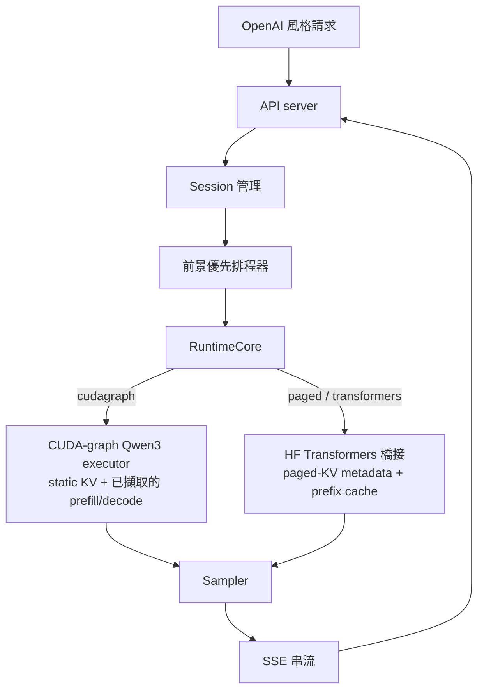

<!-- LANG-LINKS -->
[English](README.md) · **繁體中文**

# SoloRT

**針對消費級 NVIDIA GPU 的單使用者、單 GPU LLM 推論執行環境 —— 為單一互動工作階段調校,並在此工作負載上比 vLLM 更快。**

SoloRT 鎖定介於玩具範例與資料中心服務堆疊之間的本地互動工作負載:一位使用者、一張消費級 NVIDIA GPU、
長時間存續的 chat / code / RAG / agent 工作階段,並且偏好低前景延遲而非整體吞吐量。

## 效能

單流(single-stream)、greedy、精確輸出,RTX 4080 16 GB,Qwen3,對比 vLLM v0.8.5
(`SOLORT_EXECUTOR=cudagraph`):

| 模型       | SoloRT 解碼 | vLLM 解碼 | SoloRT TTFT | vLLM TTFT |
| ---------- | ----------- | --------- | ----------- | --------- |
| Qwen3-0.6B | ~150-180 tok/s(**1.6-2.0×**) | 91 tok/s | ~12 ms(**勝**) | 22 ms |
| Qwen3-4B   | ~67 tok/s(**1.21×**)         | 56 tok/s | ~27 ms(**勝**) | 30 ms |

SoloRT 在「解碼吞吐量」與「首字延遲(TTFT)」兩項指標、兩個模型上都勝過 vLLM,且輸出與 greedy 逐位元等價
—— 從 ~11 tok/s 的 HuggingFace eager 基準一路優化而來。方法與完整優化歷程見
[records.md](records.md) 與 [docs/devlog.md](docs/devlog.md)。

## 如何達成

互動式 batch-1 解碼瓶頸在於 **kernel 啟動 / 權重記憶體頻寬**,而非運算量。快速路徑(`cudagraph` executor)
是一份手寫、對 CUDA graph 友善的 Qwen3 前向傳遞,搭配 SoloRT 自有的 static KV:

- **CUDA graphs** 同時用於 prefill 與單 token 解碼(依長度分桶,注意力只掃描有效 token)——消除每 token 的
  kernel 啟動開銷。
- **在 GPU 上做 greedy argmax**(在 graph 內完成,不必對 151,936 詞彙做 eager argmax)。
- **GQA 不展開 KV**(不使用 `repeat_interleave`)。
- **融合 QKV / gate-up GEMM** 與 **增量式 detokenize**。

## 快速開始

先建置 NGC GPU 映像並預抓權重:

```bash
make docker-ngc-build
make docker-hf-prefetch
```

執行 CUDA-graph 快速路徑(Qwen3 + CUDA):

```bash
docker run --rm --gpus all --ipc=host --ulimit memlock=-1 --ulimit stack=67108864 \
  -p 8000:8000 \
  -e SOLORT_EXECUTOR=cudagraph -e SOLORT_MODEL_ID=Qwen/Qwen3-4B \
  -e SOLORT_GRAPH_MAX_LEN=1024 -e SOLORT_ENABLE_THINKING=0 \
  -v "$HOME/.cache/huggingface":/root/.cache/huggingface \
  solort:qwen3-4b-spec-ngc
```

接著呼叫 OpenAI 相容端點:

```bash
curl -N http://127.0.0.1:8000/v1/chat/completions \
  -H 'content-type: application/json' \
  -d '{"model":"Qwen/Qwen3-4B","stream":true,
       "messages":[{"role":"user","content":"用繁體中文簡短介紹 SoloRT。"}],
       "max_tokens":128,"temperature":0}'
```

## Executor(執行器)

以 `SOLORT_EXECUTOR` 選擇執行環境:

| 值 | 說明 |
| -- | ---- |
| `cudagraph` | **快速路徑。** 自訂 CUDA-graph Qwen3 前向。單一活躍序列(單使用者情境)、僅支援 Qwen3 系列 + CUDA、精確 greedy。單流下勝過 vLLM。 |
| `paged`(預設) | 通用的 HuggingFace Transformers 橋接,搭配 SoloRT 排程、paged-KV metadata、prefix cache 與可選的 FlashInfer 注意力。適用任何 HF causal LM。 |
| `transformers` | 同上的 HF 橋接,`attention_backend=auto`。 |

`SOLORT_GRAPH_MAX_LEN` 限定 cudagraph static KV 的 prompt+生成長度(預設 1024;愈大記憶體區域性愈差)。
`SOLORT_DECODE_CHUNK=K`(預設 4)每個解碼步驟輸出 K 個 greedy token,於 GPU stream 上連續 pipeline、只做一次
CPU 同步,以攤平每步固定的 Python 開銷(0.6B +7%、4B 持平;精確 greedy)。`SOLORT_SPECULATIVE_TOKENS=K`
啟用精確的 graph 化推測解碼(0.6B draft → 4B target);在 on-GPU argmax 之後已不再勝過純 target 的 cudagraph。

## 使用其他模型

執行環境與模型無關 —— 以環境變數或通用 Make 目標選擇模型:

```bash
# 任何 HF causal LM(通用 `paged` 路徑),搭配同系列的推測 draft。
make docker-ngc-up-model \
  MODEL=meta-llama/Llama-3.2-3B-Instruct DRAFT_MODEL=meta-llama/Llama-3.2-1B-Instruct

# FlashInfer 橋接無法精確建模的架構 -> 改用 Transformers 計算注意力。
make docker-ngc-up-model MODEL=google/gemma-2-2b-it DRAFT_MODEL= SPEC_TOKENS=0 ATTENTION_BACKEND=sdpa
```

| 變數 | 用途 |
| --- | --- |
| `SOLORT_MODEL_ID` | 目標模型 repo id。 |
| `SOLORT_SPECULATIVE_DRAFT_MODEL_ID` / `SOLORT_SPECULATIVE_TOKENS` | Draft 模型 + 長度 `K`(`0` 關閉)。 |
| `SOLORT_ATTENTION_BACKEND` | `flashinfer` / `sdpa` / `eager` / `flash_attention_2`(HF 路徑)。 |
| `SOLORT_TRUST_REMOTE_CODE` | 模型附帶自訂程式碼時設 `1`。 |

`cudagraph` executor 需要 Qwen3 系列模型;其他模型走 `paged` 路徑。推測解碼要求 draft 與 target 共用
tokenizer/vocab(載入時偵測到不符會關閉推測並警告)。

## 架構



資料流、排程與 KV 佈局見 [docs/architecture.md](docs/architecture.md)。

## 開發

CPU 單元測試與 lint 在 `solort:dev` 映像執行(不需 GPU / torch;需 torch 的測試會被略過):

```bash
make docker-test     # pytest
make docker-lint     # ruff
```

GPU 模型服務在 NGC 映像(`solort:qwen3-4b-spec-ngc`)執行;若主機驅動版本早於主機 PyTorch 的 CUDA build,
GPU 工作會在該容器內執行,而非主機上。

## 路線圖

- 階段 1 —— Python MVP:OpenAI 相容 API、session 管理、前景優先排程、分塊 prefill/decode、paged-KV
  metadata、block-hash prefix cache、Qwen3 HF 橋接。✅
- 階段 2 —— CUDA-graph 快速路徑:自訂 Qwen3 前向、graph 化 prefill+decode、on-GPU argmax、grouped
  attention。✅(單流勝過 vLLM)
- 階段 3 —— 量化:已在 driver 相容的 torch 2.6 映像(`Dockerfile.quant`)重新驗證。結論:在 Ada 的
  batch-1 下,weight-only int4/int8/fp8 全都比 bf16 慢(解碼 GEMM 在 M=1 是 GEMV,cuBLAS 已接近最佳);
  唯一有利的是對大型 lm_head 做 int4(4B 約 +6%,非精確)。一般性的量化加速需要 Marlin 等級的 small-N
  kernel。詳見 records/devlog。
- 階段 4 —— cudagraph 路徑的多序列 / 更長上下文支援。

## Benchmark

`benchmarks/bench_serving.py` 比較一或多個串流端點,回報 TTFT/TTOT/TPOT。整理後的結果與方法見
[records.md](records.md)。
