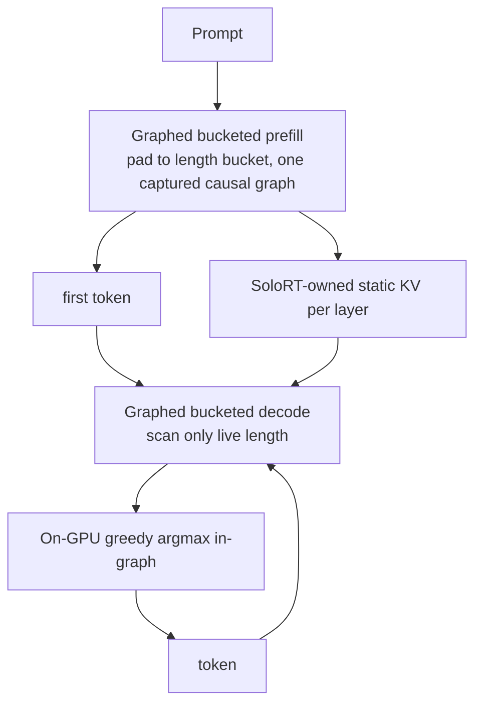
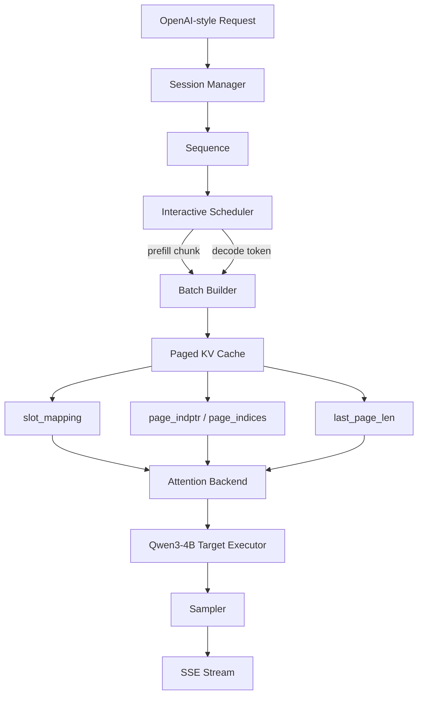
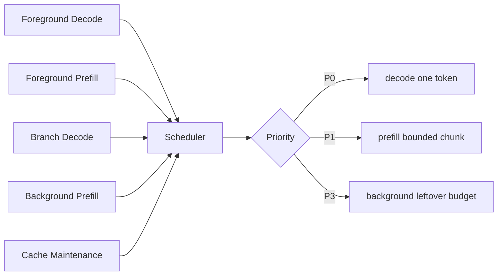
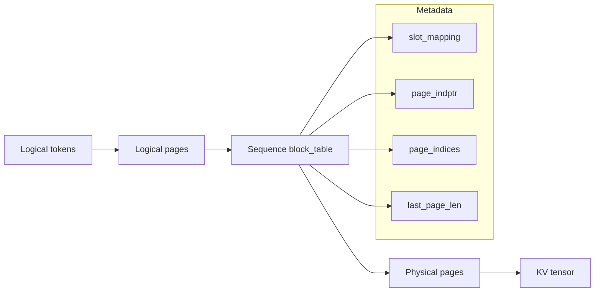
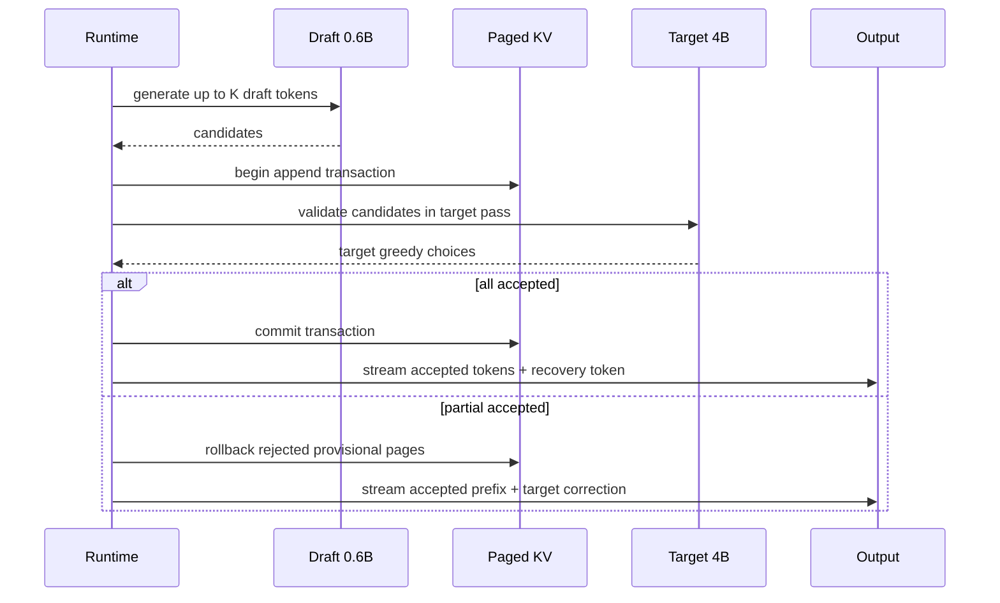
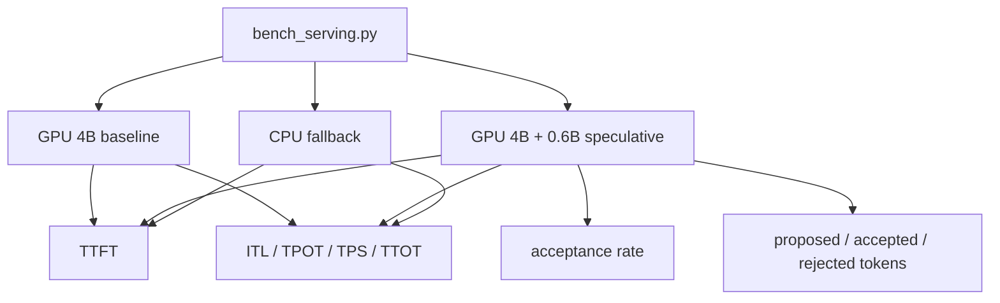

# SoloRT Architecture

SoloRT is a single-user, single-GPU runtime optimized for interactive local chat on consumer NVIDIA
GPUs. It has two execution paths behind one OpenAI-compatible API and scheduler:

- **`cudagraph` (fast path)** — a custom, CUDA-graph Qwen3 forward that beats vLLM single-stream
  (see below). Single active sequence, Qwen3-family + CUDA, exact greedy.
- **`paged` / `transformers` (general path)** — a HuggingFace-Transformers bridge with SoloRT
  scheduling, paged-KV metadata, prefix cache, and a FlashInfer attention option. Works for any HF
  causal LM. The rest of this document describes this path's KV/scheduling machinery, which the
  fast path bypasses with its own static KV.

## CUDA-Graph Fast Path

The interactive batch-1 decode is kernel-launch / weight-memory bound, not compute bound, so the
fast path removes per-token CPU and launch overhead:



Key techniques (`src/solort/model/cuda_graph_executor.py`): CUDA-graph capture of prefill and the
single-token decode (bucketed by length); on-GPU argmax inside the graph (no eager vocab argmax);
grouped-query attention without materializing the GQA-expanded KV (no `repeat_interleave`); fused
QKV / gate-up GEMMs; incremental detokenization. Numbers in [../records.md](../records.md).

## Serving Data Flow (general `paged` path)



## Foreground-First Scheduling



Decode is intentionally scheduled ahead of prefill. This protects inter-token latency when a long
background prompt is being prefetched.

## Paged KV Layout



SoloRT's tensor-backed layout is FlashInfer-friendly:

```text
kv_cache: [num_pages, 2, page_size, num_kv_heads, head_dim]
```

The `2` dimension stores key then value. The control plane works without tensor allocation so unit
tests can run on CPU-only machines.

## Greedy Speculative Decoding



v1 speculative decoding is enabled only for deterministic decoding (`temperature=0`). Sampling
support needs stochastic acceptance logic and is intentionally deferred.

## Benchmark Surface



The metrics endpoint exposes runtime latency counters, page usage, prefix cache hit/miss counts,
and executor speculative counters.
