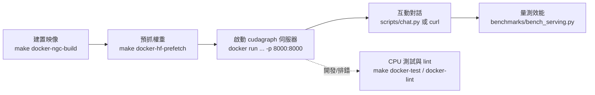
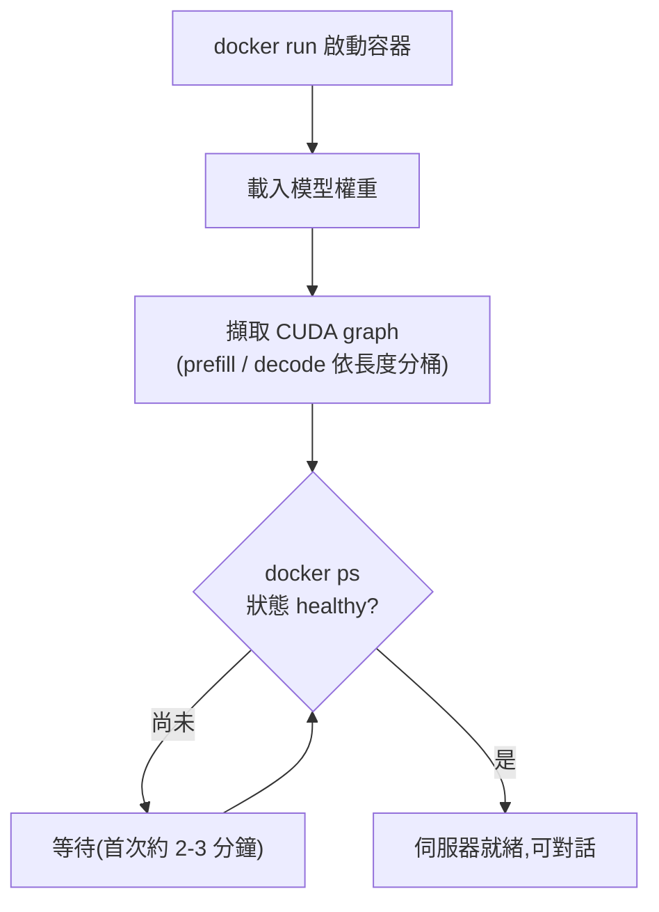
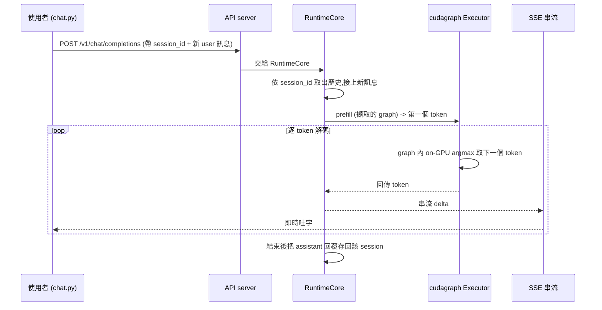
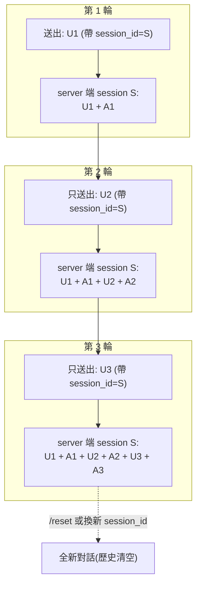
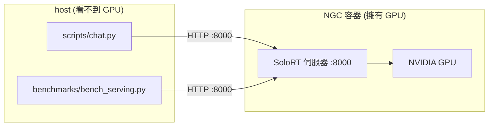

[← 中文文件首頁](../README.md)

# 快速上手:從零到互動對話(end-to-end 教學)

這是一份「從零開始」的 end-to-end 教學。讀完並照做之後,你會在自己的 NVIDIA GPU 上把 SoloRT 跑起來,
開一個 OpenAI 相容的伺服器,並且用一個多輪、會串流、有對話歷史的 chat 客戶端跟它對話,最後還能自己量測效能。
即使你完全沒看過這個專案,也能照著本文一路走完。

整體流程如下:



---

## 1. 它是什麼、適合誰

SoloRT 是一個「單使用者、單 GPU」的 LLM 推論執行環境(inference runtime),專門鎖定**消費級 NVIDIA GPU
上的本地互動工作負載**:一位使用者、一張卡、長時間的 chat / code / RAG / agent 工作階段。

它的取捨很明確:**偏好低前景延遲(foreground latency)而非整體吞吐量(throughput)**。也就是說,它不是設計來
同時服務上百個併發請求的資料中心方案,而是讓「你一個人」用得最順、回字最快。在這個工作負載上,SoloRT 比 vLLM 更快,
而且提供 OpenAI 相容 API,既有的 OpenAI 用戶端工具大多可以直接接上。

| 適合 | 不適合 |
| --- | --- |
| 一個人、一張消費級 NVIDIA 卡的本地互動 | 多使用者高併發的線上服務 |
| 在意「第一個字多快出現」與「逐字吐字速度」 | 只在意整體 tokens/s 總吞吐量 |
| 長時間 chat / code / RAG / agent 對話 | 批次離線大量推論 |

SoloRT 有兩條執行路徑,由環境變數 `SOLORT_EXECUTOR` 選擇:

| `SOLORT_EXECUTOR` | 說明 | 限制 |
| --- | --- | --- |
| `cudagraph`(快速路徑) | 手寫、對 CUDA graph 友善的 Qwen3 forward,跑在 SoloRT 自有的 static KV 上,以 CUDA graph 擷取並重播。單流(single-stream)勝過 vLLM。 | 單一活躍序列、僅 Qwen3 系列、僅 CUDA、精確 greedy |
| `paged`(預設)/ `transformers` | HuggingFace Transformers 橋接,搭配 SoloRT 排程、paged-KV metadata、prefix cache、可選 FlashInfer 注意力。 | 適用任何 HF causal LM |

本教學以**快速路徑 `cudagraph`** 為主,因為它就是 SoloRT「比 vLLM 快」的那條路。

---

## 2. 前置需求

開始之前,請確認下列條件:

- **一張 NVIDIA GPU**(消費級即可)。本機開發環境為 RTX 4080 16GB、driver 560.94 / CUDA 12.6、WSL2。
- **Docker**,且能用 `--gpus all` 把 GPU 傳進容器(WSL2 上需安裝好 NVIDIA Container Toolkit)。
- 本機已建好(或即將建好)的映像。下表是本專案會用到的映像:

| 映像 | 用途 | 需要 GPU |
| --- | --- | --- |
| `solort:dev` | CPU 單元測試 / lint(免 GPU、免 torch) | 否 |
| `solort:qwen3-0.6b-ngc` | 跑 Qwen3-0.6B 的 NGC GPU 映像 | 是 |
| `solort:qwen3-4b-spec-ngc` | 跑 Qwen3-4B 的 NGC GPU 映像 | 是 |
| `solort:quant` | 量化 GEMM 探測研究用 | 是 |

> **重要:host 的 torch 看不到 GPU。** 在這台機器上,主機端安裝的 PyTorch CUDA build 與主機 driver 不相容,
> 所以**所有 GPU 工作都必須在容器內跑**(NGC 映像)。在 host 直接跑 GPU 推論不會成功——這不是 bug,而是
> 環境設計。詳見第 8 節排錯。

HF 權重會快取在 `$HOME/.cache/huggingface`,我們會把這個目錄掛進容器,避免每次重抓。

---

## 3. 建置映像與預抓權重

第一次使用時,先建置 NGC GPU 映像,再把模型權重預抓到本機快取(只需做一次):

```bash
make docker-ngc-build     # 建置 NGC GPU 映像
make docker-hf-prefetch   # 預抓 HF 權重到 $HOME/.cache/huggingface
```

`make docker-hf-prefetch` 會把權重下載到 `$HOME/.cache/huggingface`。因為之後 `docker run` 會把這個目錄掛進
容器,所以權重只需下載一次,後續啟動不會重抓。

---

## 4. 啟動 cudagraph 快速路徑伺服器

伺服器在容器內啟動,對外開 `8000` 連接埠(port),提供 OpenAI 相容的 `/v1/chat/completions`。

### 4.1 Qwen3-0.6B(最快、最省資源)

```bash
docker run --rm --gpus all --ipc=host --ulimit memlock=-1 --ulimit stack=67108864 -p 8000:8000 \
  -e SOLORT_EXECUTOR=cudagraph -e SOLORT_MODEL_ID=Qwen/Qwen3-0.6B \
  -e SOLORT_GRAPH_MAX_LEN=1024 -e SOLORT_ENABLE_THINKING=0 -e SOLORT_DECODE_CHUNK=4 \
  -v "$HOME/.cache/huggingface":/root/.cache/huggingface -v "$PWD/src":/app/src \
  solort:qwen3-0.6b-ngc
```

### 4.2 Qwen3-4B(品質更好、需要更多資源)

跟 0.6B 幾乎一樣,只要**換映像**為 `solort:qwen3-4b-spec-ngc`、把 `SOLORT_MODEL_ID` 改成 `Qwen/Qwen3-4B`:

```bash
docker run --rm --gpus all --ipc=host --ulimit memlock=-1 --ulimit stack=67108864 -p 8000:8000 \
  -e SOLORT_EXECUTOR=cudagraph -e SOLORT_MODEL_ID=Qwen/Qwen3-4B \
  -e SOLORT_GRAPH_MAX_LEN=1024 -e SOLORT_ENABLE_THINKING=0 -e SOLORT_DECODE_CHUNK=4 \
  -v "$HOME/.cache/huggingface":/root/.cache/huggingface -v "$PWD/src":/app/src \
  solort:qwen3-4b-spec-ngc
```

### 4.3 `SOLORT_GRAPH_MAX_LEN` 該設多少?

`SOLORT_GRAPH_MAX_LEN` 決定 cudagraph static KV 能容納的 **prompt + 生成** 長度上限(預設 `1024`)。

**建議直接用 `1024`(或更大,只要記憶體夠)。** 早期較大的 KV 緩衝會因記憶體局部性而拖慢解碼,
但在 [grouped attention 優化](../04-優化歷程/README.md)之後,這個懲罰已大致消除 —— 現在 `graph_max_len`
主要決定「能容納多長的對話/context」,對 4B 解碼速度影響很小。設太小(例如 `256`)只省一點記憶體,
卻會讓較長的 prompt 或多輪對話直接裝不下而報錯。

> ⚠️ batch-1 解碼吞吐量對 **GPU boost 時脈狀態**非常敏感:消費級顯卡 / WSL2 在 token 之間 util 偏低時會降頻,
> 因此 4B 的實測值有明顯 run-to-run 變異(本機觀察到約 55–67 tok/s,GPU 維持 boost 時接近 67、約 1.21× vLLM;
> 降頻時會更低)。下面表格中的數字是 GPU 維持 boost 時脈時的代表值。

> 注意:`GRAPH_MAX_LEN` 不夠時請求會放不進 static KV(見第 8 節)。多輪對話的歷史會逐輪累積長度,選值時要把
> 歷史一起算進去。

### 4.4 第一次啟動要等 graph 擷取

第一次啟動約需 **2-3 分鐘**:這段時間在「載入權重」+「擷取 CUDA graph」(把 prefill 與 decode 依長度分桶後逐一
擷取並重播)。請耐心等候,等 `docker ps` 顯示容器狀態為 **healthy** 後即可開始對話。



> 提示:上面的 `docker run` 使用 `--rm` 會在前景執行。若要在背景跑並方便管理,可加上 `-d --name solort`,
> 之後就能用 `docker logs -f solort`、`docker rm -f solort`(見第 8 節)。

---

## 5. 互動對話

伺服器就緒後,有兩種對話方式:推薦用內建的 `scripts/chat.py`,或用等價的 `curl`。

### 5.1 推薦:`scripts/chat.py`(多輪、串流、有歷史)

`scripts/chat.py` 是一個互動式多輪 chat 客戶端,在 **host** 上用 Python 標準庫即可執行(伺服器要先開):

```bash
python3 scripts/chat.py --model Qwen/Qwen3-4B
```

啟動後在 `> ` 提示字元輸入訊息按 Enter,回覆會**即時串流**。它支援的指令與參數:

| 指令 / 參數 | 作用 |
| --- | --- |
| `/reset` | 開新對話(換一個新的 session,清掉歷史) |
| `/exit`(或 `Ctrl-D`) | 離開 |
| `--model` | 選模型(需與伺服器一致,如 `Qwen/Qwen3-0.6B`) |
| `--max-tokens` | 每次回覆的最大 token 數 |
| `--temperature` | 取樣溫度(`0` 為精確 greedy) |
| `--url` | 伺服器位址(預設 `http://127.0.0.1:8000`) |

`chat.py` 的關鍵設計:它在啟動時挑一個固定的 `session_id`,**每一輪只送出你新打的那句 user 訊息**,
不重送整段歷史。server 端會依 `session_id` 把先前輪次接在前面、並把每次 assistant 回覆接在後面。
`/reset` 就是換一個新的 `session_id`,等於開一段全新、無歷史的對話。

### 5.2 一次 chat 請求的內部流程

從你按下 Enter 到看見串流回字,內部大致是這樣:



### 5.3 等價的 `curl`(帶固定 `session_id` 才有歷史)

如果你想直接打 API,可用 `curl`。**重點:要帶固定的 `session_id`,server 才會幫你保存並接續歷史**;
不帶 `session_id` 則每次都是全新對話(無歷史)。

```bash
curl -N http://127.0.0.1:8000/v1/chat/completions -H 'content-type: application/json' \
  -d '{"model":"Qwen/Qwen3-4B","stream":true,"session_id":"mychat-1","messages":[{"role":"user","content":"你的問題"}],"max_tokens":256,"temperature":0}'
```

同一個 `session_id`(這裡是 `mychat-1`)連續打多次,server 會把前後輪接起來;換一個新的 `session_id` 就是新對話。

### 5.4 歷史是 server 端依 `session_id` 保存

再強調一次這個對教學最重要的觀念:**對話歷史保存在 server 端**,以 `session_id` 為鍵。你**每輪只要送新的 user
訊息**即可,不用(也不該)自己把整段歷史重送一遍——server 會自動把先前輪次接在前面、把每次 assistant 回覆接在後面。



> 因為歷史會逐輪變長,使用 `cudagraph` 時別忘了讓 `SOLORT_GRAPH_MAX_LEN` 足夠容納「累積歷史 + 新 prompt + 生成」。

---

## 6. 量測效能

`benchmarks/bench_serving.py` 是純標準庫的量測工具,在 **host** 上跑(伺服器要先開好)。它會對串流端點量測 TTFT、
解碼速度等指標:

```bash
python3 benchmarks/bench_serving.py --case solort=http://127.0.0.1:8000 --model Qwen/Qwen3-0.6B \
  --temperature 0 --max-tokens 200 --warmup 2 --runs 5
```

你會看到的主要指標:**decode tps(每秒解碼幾個 token)** 與 **TTFT(time-to-first-token,第一個字多快出現)**;
另外還有 TPOT / ITL / overall TPS / TTOT 等延伸數字。

下表是本機(RTX 4080 16GB、single-stream、greedy、輸出逐位元精確,對比 vLLM v0.8.5.post1)的參考數字:

| 模型 | SoloRT 解碼 | vLLM 解碼 | SoloRT TTFT | vLLM TTFT |
| --- | --- | --- | --- | --- |
| Qwen3-0.6B(`cudagraph`) | ~160 tok/s(`SOLORT_DECODE_CHUNK=4`;未開為 149),約 **1.76×** | 91 tok/s | ~10-12ms(**勝**) | 22ms |
| Qwen3-4B(`cudagraph`) | ~55–67 tok/s(GPU 維持 boost 時接近 67),約 **持平–1.21×** | 55.6 tok/s | ~27ms(**勝**) | 30ms |

對照基準:HuggingFace eager 約只有 11-15 tok/s。結論:**0.6B 解碼與 TTFT 都大勝;4B 約為持平到 1.21×**;
兩者都與 greedy 逐位元等價。

> ⚠️ 再次提醒:4B 的 batch-1 解碼吞吐量對 GPU boost 時脈很敏感(見 [4.3](#43-solort_graph_max_len-該設多少)),
> 表中 ~67 是維持 boost 時的代表值;若你在 WSL2 或顯卡降頻時量到較低的數字(如 ~30–50)屬正常現象,
> 並非設定錯誤。要量到代表值,請先用連續生成把 GPU 暖機到 boost、並避免同時有其他 GPU 工作。

---

## 7. 開發者:CPU 測試 + lint

不需要 GPU 也能跑單元測試與 lint——它們在 `solort:dev` 映像裡跑(免 GPU、免 torch;依賴 torch 的測試會被跳過):

```bash
make docker-test     # pytest(CPU 單元測試)
make docker-lint     # ruff(lint)
```

之所以能在純 CPU 跑,是因為 SoloRT 的控制平面(scheduling / paged-KV metadata)不需要配置 tensor,
所以單元測試在沒有 GPU 的機器上也能完整執行。

---

## 8. 管理與排錯

### 8.1 看 log、停容器

| 動作 | 指令 |
| --- | --- |
| 跟著看即時 log | `docker logs -f <name>` |
| 停掉並移除容器 | `docker rm -f <name>` |

`<name>` 是容器名稱。若啟動時沒指定名稱,可用 `docker ps` 查看;或在 `docker run` 加上 `-d --name solort`
(背景執行並命名),之後就用 `docker logs -f solort` / `docker rm -f solort` 管理。

### 8.2 `graph_max_len` 不夠時的錯誤

`cudagraph` 的 static KV 容量由 `SOLORT_GRAPH_MAX_LEN` 決定。當「累積對話歷史 + 新 prompt + 要生成的 token」
**超過** `SOLORT_GRAPH_MAX_LEN` 時,請求會放不進 static KV 而失敗。常見於多輪對話越聊越長之後。處理方式:

- 在 `chat.py` 用 `/reset` 開新對話(清掉累積歷史),或在 curl 換一個新的 `session_id`。
- 啟動容器時把 `SOLORT_GRAPH_MAX_LEN` 調大(例如 `1024` → `2048`);grouped attention 之後這對 4B 解碼速度影響很小,只多用一點記憶體。
- 降低單次 `--max-tokens`,讓「prompt + 生成」落在上限內。

### 8.3 為何 host 看不到 GPU?

這台機器的主機端 PyTorch CUDA build 與主機 driver 不相容,因此 **host 上的 torch 偵測不到 GPU**。
解法不是修 host,而是**把所有 GPU 工作放進 NGC 容器內跑**(也就是第 4 節的 `docker run`)。
`chat.py` 與 `bench_serving.py` 之所以能在 host 跑,是因為它們只是純標準庫的 HTTP 用戶端——真正的 GPU 推論
發生在容器裡的伺服器,host 端只負責送請求、收串流。



---

## 延伸閱讀

- [系統架構](../02-系統架構/README.md) — 資料流、排程、KV 佈局
- [快速路徑原理](../03-快速路徑原理/README.md) — cudagraph 的 CUDA graph 擷取與 on-GPU argmax 等技術
- [優化歷程](../04-優化歷程/README.md) — 一路把解碼從 ~11 tok/s 推到比 vLLM 快的過程
- [效能與量化](../05-效能與量化/README.md) — roofline / profiling 與量化探討結論
