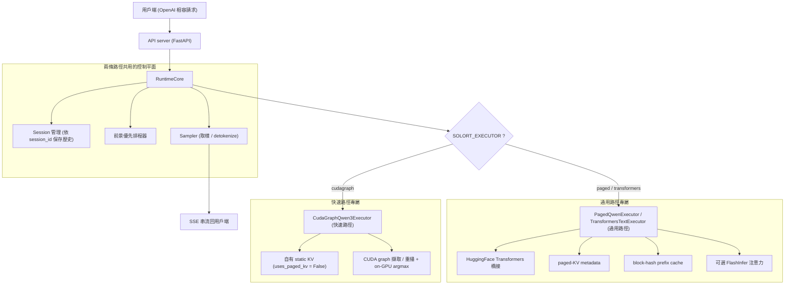
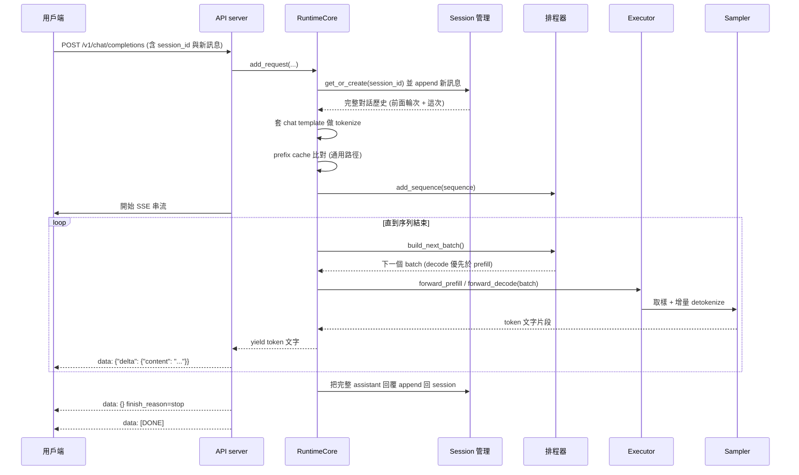
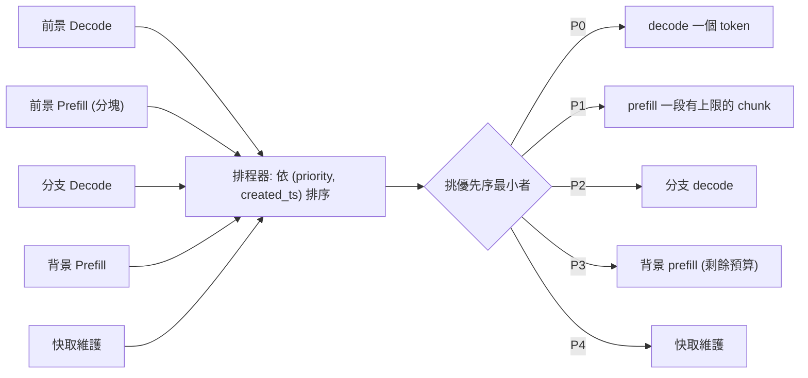
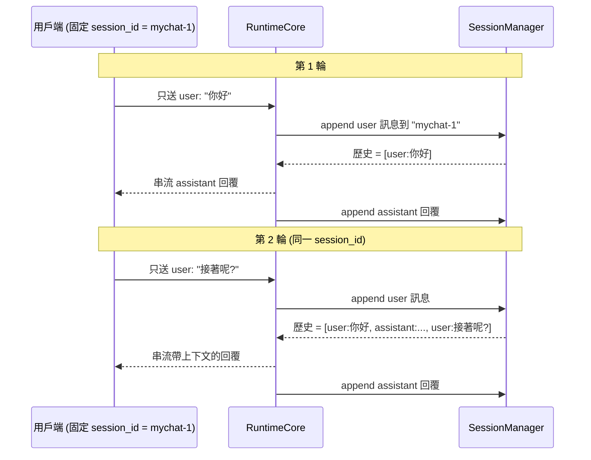
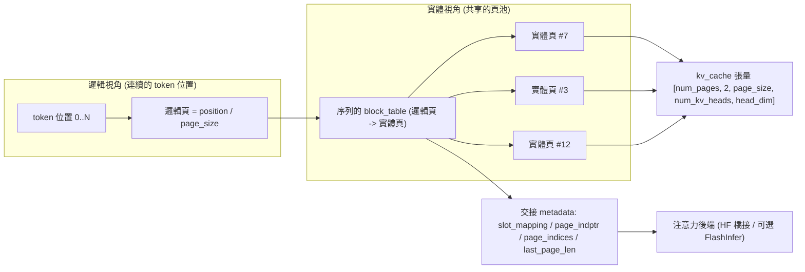
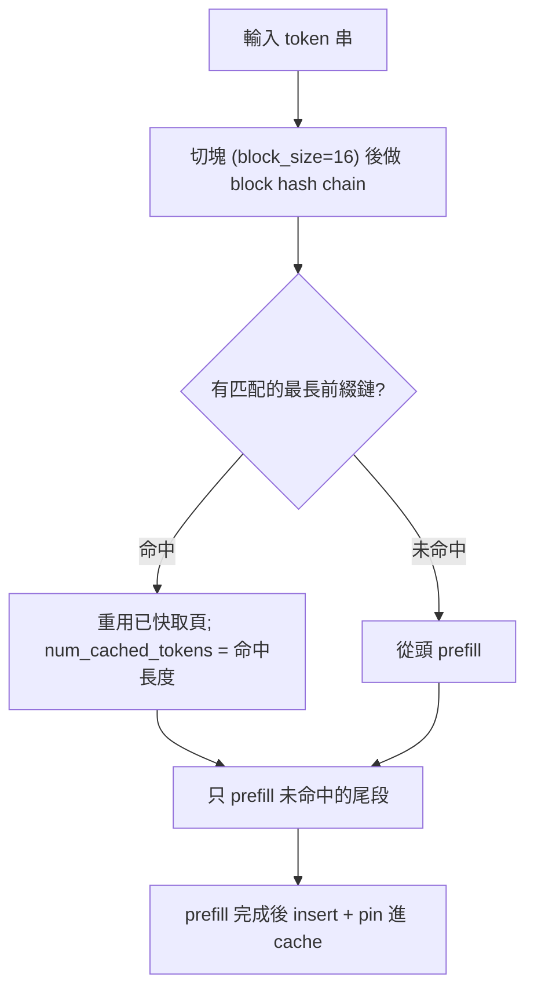

[← 中文文件首頁](../README.md)

# 系統架構總覽

這份文件帶你從「一個 OpenAI 風格的請求進來」一路看到「token 透過 SSE 串流回去」,把 SoloRT 的整體架構與資料流拆解清楚。即使你沒看過這個專案,讀完之後也應該能回答:

- SoloRT 為什麼有「兩條執行路徑」?它們各自適合什麼、又有什麼限制?
- 一個請求從 API server 到 SSE 串流,中間經過哪些元件?
- 為什麼排程器要把 decode 排在 prefill 前面?
- `session_id` 是怎麼讓多輪對話「不用每次重送歷史」的?
- 通用路徑的 paged-KV 是怎麼把「邏輯上的 token 位置」對應到「實體記憶體」的?

---

## 1. 專案定位:單使用者、單 GPU

SoloRT 是一個鎖定「**單使用者、單 GPU**」的 LLM 推論執行環境,設計給消費級 NVIDIA GPU 上的本地互動工作負載 —— 一位使用者、一張卡、長時間的 chat / code / RAG / agent 工作階段。

它的取捨很明確:**偏好低前景延遲(latency),而不是整體吞吐量(throughput)**。在這個工作負載上,它比 vLLM 更快,同時提供 OpenAI 相容 API。

> 這個取捨會貫穿整份架構:你會看到排程器優先保護「正在串流給使用者的那一個序列」,而不是追求把 GPU 餵到最滿。

---

## 2. 兩條執行路徑

SoloRT 對外只有「一套 API + 一套排程」,但底層有**兩條執行路徑**,由環境變數 `SOLORT_EXECUTOR` 決定要載入哪一個 Executor:

| 路徑 | `SOLORT_EXECUTOR` 值 | 一句話定位 |
| --- | --- | --- |
| 快速路徑 | `cudagraph` | 手寫、對 CUDA graph 友善的 Qwen3 forward,跑在自有 static KV 上,以 CUDA graph 擷取並重播 |
| 通用路徑(預設) | `paged`(或 `transformers`) | HuggingFace Transformers 橋接,搭配 SoloRT 排程、paged-KV metadata、prefix cache、可選 FlashInfer 注意力 |

### 2.1 cudagraph 快速路徑

把整個單序列的 prefill 與單 token decode 用 CUDA graph 擷取下來重播,消除每個 token 的 kernel 啟動與 Python 開銷。它是「為了最快互動延遲而做的特化」。

- **定位**:單流(single-stream)互動聊天追求最低延遲時的首選。
- **限制**:單一活躍序列、僅 Qwen3 系列、僅 CUDA、僅精確 greedy。
- **效能(RTX 4080 16GB,single-stream,greedy,逐位元等價)**:Qwen3-0.6B 解碼約 160 tok/s(約 1.76× vLLM)、TTFT 約 10-12ms;Qwen3-4B 約 55–67 tok/s(GPU 維持 boost 時接近 67,約 1.21× vLLM;batch-1 對時脈狀態敏感)。

> 快速路徑的內部技巧(bucketing、on-GPU argmax、GQA batched matmul、融合 GEMM、chunked decode)屬於另一份文件的主題,詳見 [快速路徑原理](../03-快速路徑原理/README.md)。

### 2.2 paged / transformers 通用路徑

透過 HuggingFace Transformers 橋接做層運算,但**排程、page 表、prefix cache、metrics、串流邊界都由 SoloRT 自己掌控**。

- **定位**:預設路徑,適用任何 HF causal LM(不限 Qwen3),也是 paged-KV / prefix cache 等控制平面機制的載體。
- **限制**:每個 token 走 HF 的 forward,沒有 CUDA graph 重播帶來的固定開銷攤平,因此延遲不如快速路徑;目前仍以 HF 的 `past_key_values` 做實際 KV 儲存,張量化的 paged runner 仍在路上。
- **優點**:控制平面不需要配置任何 tensor,所以**單元測試可以在純 CPU 上跑**(不需要 GPU、不需要 torch 也能驗證 page 語意與排程)。

### 2.3 元件總覽(含兩條分支)

下圖是整體架構鳥瞰。注意上半部(API → Session → 排程器 → RuntimeCore → Sampler → SSE)是**兩條路徑共用**的,只有 Executor 與其 KV 機制依 `SOLORT_EXECUTOR` 分岔:



---

## 3. 從 OpenAI 請求到 SSE 串流的完整元件鏈

通用路徑的資料流(出自 `docs/architecture.md` 與 `src/solort/core/runtime.py`)是:

```text
OpenAI 請求 -> API server -> Session 管理 -> 前景優先排程器 -> RuntimeCore -> Executor -> Sampler -> SSE 串流
```

各元件的職責如下(對應原始碼):

| 元件 | 原始碼位置 | 職責 |
| --- | --- | --- |
| API server | `src/solort/api/server.py` | 提供 `/v1/chat/completions` 等端點;把 OpenAI 風格 JSON 正規化成一個 SoloRT `Sequence`,其餘交給 RuntimeCore。刻意保持「薄」。 |
| Session 管理 | `src/solort/core/session.py` | 依 `session_id` 保存對話歷史;`get_or_create` 取出或新建 session,`append_messages` 累加訊息。 |
| 前景優先排程器 | `src/solort/core/scheduler.py` | 在多個工作之間挑選下一個要送上 GPU 的 batch,decode 永遠優先於 prefill。 |
| RuntimeCore | `src/solort/core/runtime.py` | 把上述全部接線起來:建立序列、查 prefix cache、驅動排程迴圈、組 KV metadata、呼叫 Executor、把回覆寫回 session 歷史。 |
| Executor | `src/solort/model/cuda_graph_executor.py`、`src/solort/model/executor.py` | 實際做 `forward_prefill` / `forward_decode`;快速路徑用自有 static KV,通用路徑用 HF 橋接 + paged-KV metadata。 |
| Sampler | `src/solort/model/sampler.py` | 從 logits 取出下一個 token(快速路徑在 graph 內做 greedy argmax),並做增量 detokenize 產生文字片段。 |
| SSE 串流 | `src/solort/api/streaming.py` | 把每個 token 的文字包成 `chat.completion.chunk` 事件,逐塊以 `data: ...` 推給用戶端,最後送 `[DONE]`。 |

### 3.1 請求資料流(時序圖)

下圖追蹤一個 `stream=true` 的聊天請求,從進入到串流結束:



> 關鍵觀念:**API 層很薄**。它只做 JSON ↔ `Sequence` 的轉換;session 歷史、排程、KV、取樣全都在 RuntimeCore 裡。串流迴圈每跑一圈就請排程器給「下一個該做的事」,做完把產生的文字 `yield` 出去。

---

## 4. 前景優先排程(Foreground-First Scheduling)

### 4.1 為什麼 decode 要排在 prefill 前面?

互動體驗的順不順,取決於**兩個 token 之間的間隔(inter-token latency)**,而不是「整體 prompt 吞吐量」。所以排程器刻意把「正在串流給使用者的那個序列的 decode」放在所有 prefill 之前。

典型情境:當有一個很長的背景 prompt 正在被預取(prefill)時,如果讓 prefill 搶走 GPU,使用者眼前正在打字的回覆就會卡頓。前景優先排程確保「下一個 token」永遠優先產出,保護 inter-token 延遲。

### 4.2 優先序

排程器(`InteractiveScheduler`)把所有候選序列依 `(priority, created_ts)` 由小到大排序,挑出第一個。優先序定義在 `src/solort/core/sequence.py` 的 `SchedulerPriority`(數字越小越優先):

| 優先序 | 名稱 | 做什麼 |
| --- | --- | --- |
| P0 | `FOREGROUND_DECODE` | 前景序列 decode 一個 token(最高優先,保護互動延遲) |
| P1 | `FOREGROUND_PREFILL` | 前景序列 prefill 一段有上限的 chunk |
| P2 | `BRANCH_DECODE` | 分支序列 decode |
| P3 | `BACKGROUND_PREFILL` | 背景序列 prefill(用剩下的預算) |
| P4 | `CACHE_MAINTENANCE` | 快取維護 |

prefill 一次只做「有上限的一小段」(預設 `max_prefill_chunk_tokens = 16`),這樣即使有長 prompt 在跑,也能很快讓出 GPU 給更高優先的 decode。



> 這套排程是**兩條路徑共用**的。快速路徑通常只有單一活躍序列,所以實務上排程器多半就是反覆挑那一個序列的 decode;但同一套機制讓通用路徑能在前景/背景工作之間做正確取捨。

---

## 5. Session 管理與 `session_id` 對話歷史

這是「為什麼多輪對話不用每次重送整段歷史」的關鍵,也是 `scripts/chat.py` 之所以那麼簡單的原因。

RuntimeCore **依 `session_id` 在 server 端保存對話歷史**:

- 帶**固定的 `session_id`** 時:每一輪你只要送「新的 user 訊息」。server 會自動把先前輪次接在前面,並在回覆完成後把這次的 assistant 回覆接到歷史後面。
- **不帶 `session_id`** 時:每次都是全新對話(無歷史),server 會替你產生一個一次性的 session id。

`scripts/chat.py` 就是利用這點:它在啟動時挑一個 session id,之後每輪只送新訊息;`/reset` 等於換一個新 session id 開新對話。



實作要點(`src/solort/core/runtime.py` 的 `add_request` / `_append_assistant_response`):

- 進來時先 `append_messages(session_id, 新訊息)`,再取 `session.messages` 整段歷史去 tokenize。
- 因此模型實際看到的是「歷史 + 這次的 user 訊息」。
- 序列結束(`FINISHED`)時,才把完整的 assistant 回覆 append 回 session,供下一輪使用。

> Session 管理是**兩條路徑共用**的,跟你選 cudagraph 或 paged 無關。

---

## 6. 通用路徑的 paged-KV 佈局與 prefix cache

這一節描述的機制**只屬於通用路徑**。快速路徑用它自有的 static KV,並透過 `uses_paged_kv = False` 跳過下面這整套 paged-KV 記帳,讓 decode 熱路徑不做無用的每步工作。

### 6.1 為什麼要分頁(paged)?

把每個序列的 KV cache 切成固定大小的「頁(page)」,可以避免為「最大可能長度」預留一整塊連續記憶體,並讓不同序列、甚至 prefix 相同的序列共用實體頁。SoloRT 的張量佈局刻意做成 FlashInfer 友善的形狀(BRIEF 權威佈局):

```text
kv_cache: [num_pages, 2, page_size, num_kv_heads, head_dim]
```

- 中間那個 `2` 維度:先存 key、再存 value。
- 每個 transformer 層各自擁有一塊獨立的 paged arena(實作上在前面再多一個 `num_layers` 維度,維持上面這個「每層」視圖)。
- **控制平面不需配置 tensor**:page 表與 metadata 永遠可用,張量儲存只在需要時才配置,所以 CPU-only 機器也能跑單元測試。

### 6.2 邏輯 token → 邏輯頁 → 實體頁 → KV 張量

排程/快取策略與注意力之間,靠四個 metadata 欄位交接(`src/solort/cache/kv_cache.py` 的 `metadata_for`):

| 欄位 | 意義 |
| --- | --- |
| `slot_mapping` | 把每個邏輯 token 位置映射到「攤平後的實體 KV slot」 |
| `page_indptr` | 這個序列在 `page_indices` 裡的起訖索引 |
| `page_indices` | 這個序列目前用到的實體頁清單(來自其 `block_table`) |
| `last_page_len` | 最後一頁實際用了幾個 slot |

核心換算(`slot_mapping`):

```text
logical_page = position // page_size
page_offset  = position %  page_size
slot         = block_table[logical_page] * page_size + page_offset
```

也就是說,序列只持有一張 `block_table`(邏輯頁 → 實體頁的對照),其餘都由上面的公式推出來。下圖以 `page_size = 16` 為例:



### 6.3 block-hash prefix cache

prefix cache(`src/solort/cache/prefix_cache.py`)用來重用「前綴相同」的 KV,屬於通用路徑的控制平面機制:

- 把 token 串按 `block_size`(預設 16)切塊,對每一塊做雜湊形成 hash chain。
- `match` 回傳「是 incoming token 串前綴」的最長已快取鏈,讓相同開頭的請求免於重算。
- prefix cache 在**套用 chat template 之後**才查詢,確保 cache key 與模型實際看到的 token 串對齊。
- prefill 完成後,該序列的頁會被 `insert` 進 cache 並 `pinned`,序列結束再 `release`。



> 誠實補充:prefix cache 的控制平面(雜湊、比對、頁記帳)已經就緒,但目前所有 Executor 的 `supports_prefix_cache` 旗標都是 `False`,因為實際 KV 仍交給 HF 的 `past_key_values`、張量化的 paged runner 仍在開發中。換句話說,這套機制是**為通用路徑設計、目前由旗標閘控**;它的形狀已穩定,等 paged runner 落地即可啟用。

---

## 7. 兩條路徑共用 vs 各自專屬(總覽)

| 元件 / 機制 | cudagraph 快速路徑 | paged / transformers 通用路徑 |
| --- | --- | --- |
| OpenAI 相容 API server | 共用 | 共用 |
| Session 管理 / `session_id` 歷史 | 共用 | 共用 |
| 前景優先排程器 | 共用 | 共用 |
| RuntimeCore 接線 | 共用 | 共用 |
| Sampler / 增量 detokenize | 共用(argmax 在 graph 內) | 共用 |
| SSE 串流 | 共用 | 共用 |
| KV cache | 專屬:自有 static KV(`uses_paged_kv=False`) | 專屬:paged-KV metadata |
| prefix cache | 不使用 | 通用路徑機制(目前由旗標閘控) |
| 注意力 | 手寫 GQA batched matmul(graph 內) | HF 橋接 + 可選 FlashInfer |
| CUDA graph 擷取 / 重播 | 專屬 | 無 |
| 支援的模型 | 僅 Qwen3 系列 | 任何 HF causal LM |
| 裝置 | 僅 CUDA | CPU / GPU 皆可(控制平面可純 CPU 測試) |
| 取樣模式 | 僅精確 greedy | greedy / 取樣參數 |
| 同時序列數 | 單一活躍序列 | 排程支援多型別工作 |

---

## 延伸閱讀

- [快速上手](../01-快速上手/README.md) —— 啟動伺服器、`scripts/chat.py` 多輪對話、curl 範例。
- [快速路徑原理](../03-快速路徑原理/README.md) —— cudagraph 路徑的 bucketing、on-GPU argmax、GQA batched matmul、融合 GEMM、chunked decode。
- [優化歷程](../04-優化歷程/README.md) —— 各個延遲槓桿如何一步步套用、profiling 發現。
- [效能與量化](../05-效能與量化/README.md) —— roofline 分析、benchmark 數字、量化探討結論。
