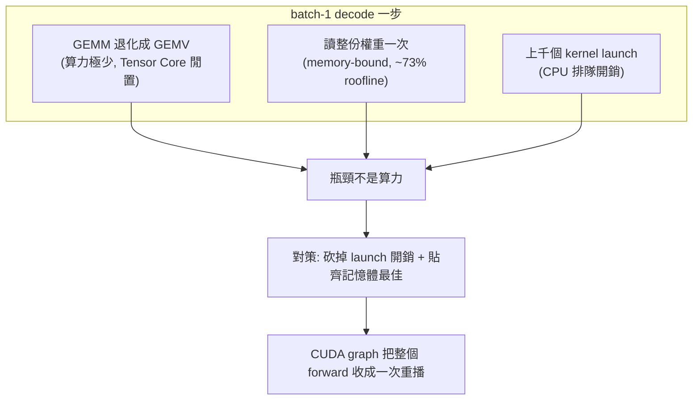
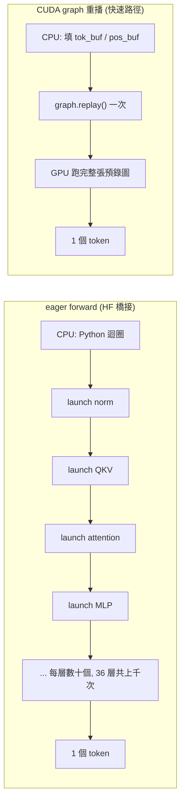
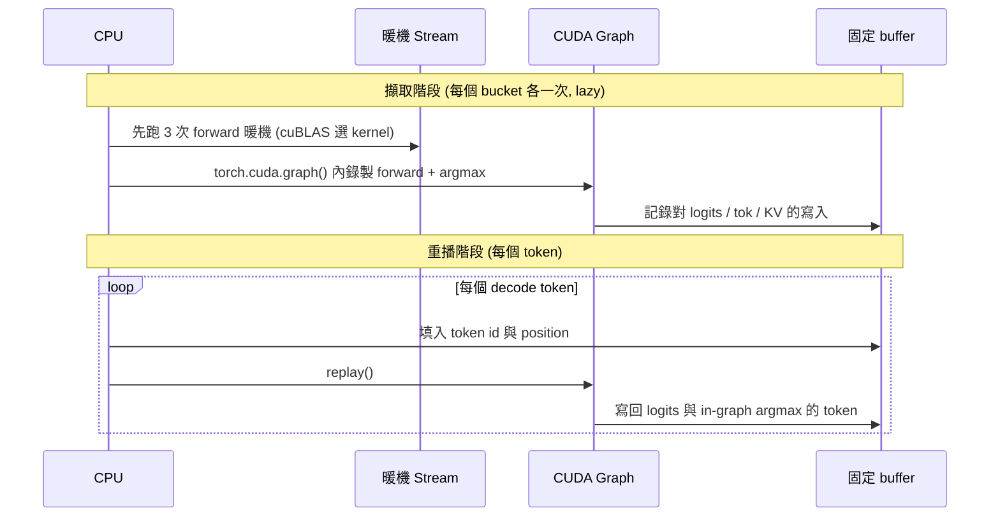
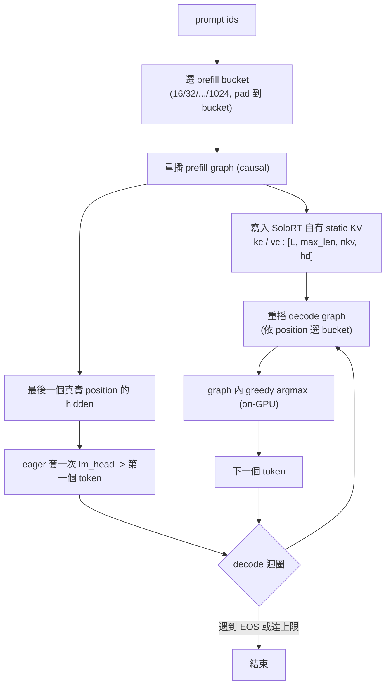
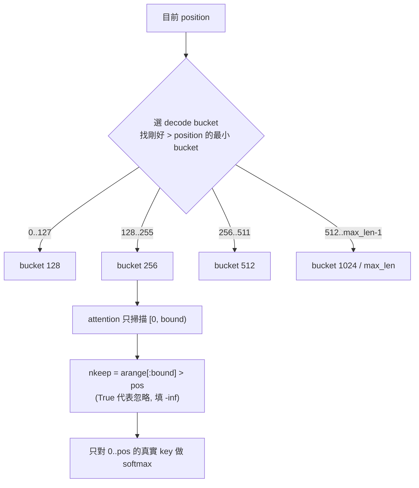
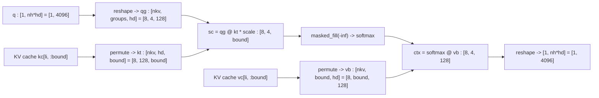
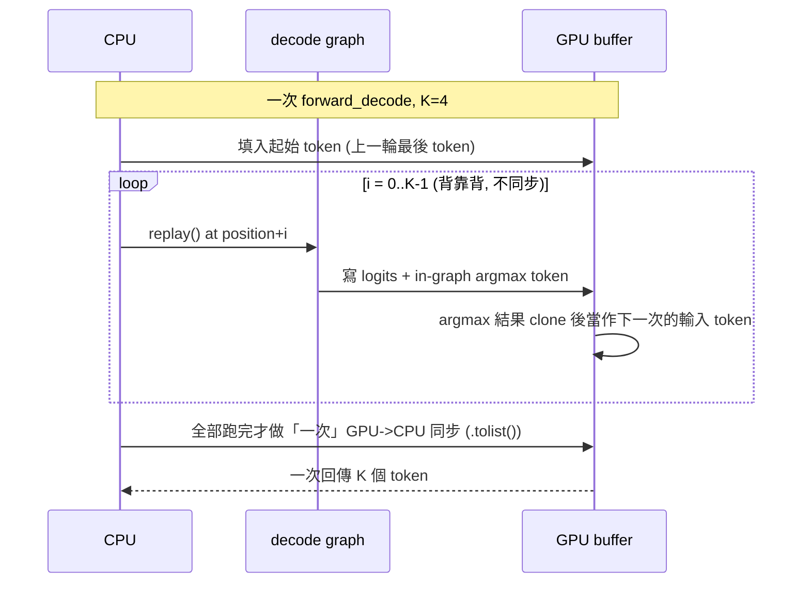

[← 中文文件首頁](../README.md)

# 快速路徑原理:CUDA graph 自訂 Qwen3 executor 怎麼運作

本篇深入解釋 SoloRT 的 `cudagraph` 快速路徑「為什麼快」以及「怎麼做到」。讀完你會理解:

- 為什麼 batch-1 的互動式 decode 不是「算力不夠」,而是被 **kernel 啟動開銷** 與 **權重記憶體頻寬** 卡住;
- CUDA graph 如何把「每個 token 一大堆 kernel 啟動」收斂成「重播一次圖」;
- 一連串針對單使用者、單序列、greedy 場景的最佳化:length bucketing、in-graph argmax、不展開 KV 的 grouped attention、融合 GEMM、增量 detokenize;
- 以及 chunked greedy decode(`SOLORT_DECODE_CHUNK`)如何把每個排程 tick 的固定 Python 開銷攤平到 K 個 token。

對應的實作檔案是 `src/solort/model/cuda_graph_executor.py`。

> 適用範圍(先講清楚):快速路徑只服務 **單一活躍序列**、**僅 Qwen3 系列**、**僅 CUDA**、**精確 greedy**。
> 這些限制不是缺陷,而是「為了把單使用者互動體驗榨到極限」刻意收斂的設計。需要通用性的場景請走預設的 `paged` 路徑。

---

## 一、先講問題:batch-1 互動 decode 到底卡在哪裡?

互動式聊天的 decode 階段,每一步只處理「一個 token」(batch size = 1)。直覺上模型很大、運算量應該很重,但事實相反:

- decode 的每一層 GEMM 在 `M=1` 時其實退化成 **GEMV**(向量乘矩陣)。算力(FLOPs)非常少,GPU 的 Tensor Core 幾乎是閒置的。
- 真正的成本有兩個:
  1. **權重記憶體頻寬**:每生一個 token,都要把模型「整份權重」從 HBM 讀過一遍。這是個 memory-bound 工作,batch-1 沒有任何權重重用可言。實測 4B 模型的 decode 約可達到 bf16 roofline 的 **73%**,代表它已經貼著「記憶體頻寬天花板」在跑——再怎麼優化算力都沒用。
  2. **kernel 啟動開銷(launch overhead)**:一次 forward 要對每一層發出數十個 CUDA kernel(norm、QKV、RoPE、attention、output、gate/up、down……)。Qwen3-4B 有 36 層,單一 token 就要 launch 上千個 kernel。每個 launch 都有固定的 CPU→GPU 排隊成本;當每個 kernel 的實際工作量本來就很小(GEMV),launch 開銷反而變成主角。

這就是為什麼直接用 HuggingFace Transformers 的 eager forward 來服務,**不管模型大小都只有 ~11 tok/s**:它一直被 CPU 端的 kernel 啟動與 Python 排程綁住,GPU 大半時間在等。

結論:**互動 decode 是 launch-bound + memory-bound,不是 compute-bound**。所以正確的優化方向不是「算更快」,而是「**別讓 CPU 一直忙著 launch**」,並讓記憶體存取貼齊最佳。CUDA graph 正是針對前者的武器。

---

## 二、核心想法:CUDA graph「擷取一次、重播多次」

CUDA graph 的概念是:把一連串 kernel 與它們之間的相依關係,**事先錄製(capture)成一張靜態的執行圖**,之後要執行時只要 `replay()` 一次,GPU 就會把整張圖跑完,**CPU 幾乎不需要逐個 launch**。

前提是「圖的形狀必須固定」——張量大小、走的分支都不能隨資料改變。HF 的 decode 是 data-dependent(長度會變、會走不同分支),所以 `torch.compile` 也無法把它整段 graph 化。SoloRT 的做法是**手寫一個對 graph 友善、形狀固定的 Qwen3 forward**,跑在自己持有的 static KV 上(position 從 buffer 讀、attention 用遮罩),這樣才能被乾淨地擷取。

下面這張圖對比 eager 與 graph 在「一個 token」上的差異——重點不是 GPU 做的事變少,而是 **CPU 端的 launch 從上千次變成一次**:

擷取的流程也很關鍵:capture 前要先在一條獨立的 CUDA stream 上「暖機」跑幾次(`_decode_forward` 跑 3 次、prefill 跑 2 次),讓 cuBLAS 等函式庫完成一次性的演算法選擇與配置,**再**正式擷取,否則這些一次性開銷會被錄進圖裡。擷取時所有寫入都落在固定 buffer(`tok_buf`、`pos_buf`、KV cache、輸出 logits),之後每次重播都重用同一批 buffer。

---

## 三、快速路徑全貌

把 prefill 與 decode 串起來看,整條快速路徑長這樣。注意第一個 token 是在 prefill 階段就算好暫存的,之後才進入逐 token 的 decode 重播迴圈:

接下來逐項拆解讓它快的技術。

---

## 四、逐項技術拆解

### (a) CUDA graph 擷取 prefill 與單 token decode

prefill 與 decode 都各自被擷取成 graph:

- **prefill graph**:對 pad 過的 prompt buffer 做一次 causal forward,輸出最後位置的 hidden。這消除了原本「eager prefill」那段佔掉大部分 TTFT 的 launch 開銷。一個小細節:prefill graph 只輸出 hidden states(約幾 MB),`lm_head` 在圖外對「單一位置」eager 套用一次,避免為每個 bucket 都配置一塊 `[bound, vocab]` 的巨大 logits buffer。
- **decode graph**:單一 token 的 forward + 取下一個 token,整段錄成圖,每個 token 重播一次。

兩者都是 lazy capture——第一次遇到某個 bucket 才擷取,之後重用。

> 為什麼用 `torch.no_grad()` 而不是 `inference_mode()`?因為 CUDA graph 的 capture/replay 需要「非 inference」張量,`inference_mode` 產生的張量無法被圖正確追蹤。

### (b) 依長度分桶(length bucketing),注意力只掃描有效長度

graph 要求形狀固定,但序列長度會一直變長。若每個長度都各錄一張圖,圖會爆炸;若一律用 `max_len` 的形狀,短序列要白掃一堆 padding。折衷做法是**分桶**:

- decode bucket:`{128, 256, 512, 1024, 2048, 4096}` 中小於 `max_len` 者,再聯集 `{max_len}`。
- prefill bucket:`{16, 32, 64, 128, 256, 512, 1024}` 中不超過 `max_len` 者(低位較細,短 prompt 少 pad 一點)。

每個 bucket 各擷取一張圖。decode 時依目前 position 路由到「**剛好大於 position 的最小 bucket**」:position 0–127 走 128 桶、128–255 走 256 桶,以此類推。

關鍵在於:**attention 只掃描到 `bound` 這個有效長度**,而不是整個 `max_len`。decode forward 內用一個遮罩 `nkeep = (arange[:bound] > pos_buf)`(True 代表要忽略),把超過目前位置的 key 設成 `-inf`,所以短序列真的便宜很多。prefill 則靠 causal mask 天然成立:被 pad 的 token 落在較後面的 causal 位置,真實 token 不會去 attend 到它們,因此真實位置的 hidden 是精確的(padding 的 KV 是垃圾,但 decode 的遮罩永遠不讀它)。

效果:短對話(常見的互動情境)只掃幾百個 key 而不是上千,attention 成本與序列長度成正比,而不是固定吃滿 `max_len`。

### (c) 在 graph 內做 greedy argmax(避免 eager 掃 151,936 vocab)

Qwen3 的 vocab 高達 **151,936**。原本在 GPU 算完 logits 後,要在 CPU 端對這 15 萬維做 eager argmax 取下一個 token——這一步量到約 **5ms/token**,而且發生在 GPU 已經閒置、CPU 卻還在忙的時候,等於白白拖慢逐 token 速度。

對策:把 argmax **錄進 graph 裡**(`lg.argmax(-1)`),在 GPU 上和 forward 一起 pipeline。重播完直接讀出那「1 個元素」的 token id,不必把整條 logits 拉回 CPU 再掃。`decode_argmax` / `decode_gpu_argmax` 走的就是這條路。(若是 sampling/帶 repetition penalty 的非 greedy 請求,才退回 `decode` 取完整 logits 在外面取樣。)

### (d) Grouped-query attention 不展開 KV

Qwen3-4B 是 GQA:**32 個 attention head 共用 8 個 KV head**(每 4 個 Q head 共享 1 組 KV,`groups = nh / nkv = 4`)。最直覺的實作是用 `repeat_interleave` 把 KV 複製成 32 份再做標準 attention——但這會把 KV 在記憶體裡放大 4 倍,對 memory-bound 的 decode 是反效果。

快速路徑直接把 KV cache 讀成 `[nkv, bound, hd]`,並把 Q reshape 成 `[nkv, groups, hd]`,用 **batched matmul** 一次算完,完全不複製 KV。張量形狀的流動如下(以 4B:`nkv=8`、`groups=4`、`hd=128` 為例):

重點:`kt` 與 `vb` 都是對「同一份未展開的 8 頭 KV」做 permute(零複製的 view),groups 維度靠 batched matmul 廣播吃掉。省下的是頻寬,而頻寬正是 decode 的瓶頸。

### (e) 融合 QKV / gate-up GEMM

每一層原本有獨立的 `q_proj`、`k_proj`、`v_proj` 三個 GEMM,以及 MLP 的 `gate_proj`、`up_proj` 兩個 GEMM。在 batch-1 下,**發更少、更大的 GEMM** 比發很多小 GEMM 有效率(少 launch、cuBLAS 也更好排程)。

快速路徑在載入時就把權重沿輸出維度 `cat` 起來:`q/k/v` 三合一成 `wqkv`、`gate/up` 兩合一成 `wgu`,forward 算完再用 `split` 切回去。以 Qwen3-4B(`hidden=2560`)為例:

| 融合 GEMM | 輸入 | 權重 (out × in) | 輸出 | 說明 |
| --- | --- | --- | --- | --- |
| `wqkv` (q+k+v) | 2560 | 6144 × 2560 | 6144 | q_dim 4096 + kv_dim 1024 + kv_dim 1024 |
| `wgu` (gate+up) | 2560 | 19456 × 2560 | 19456 | gate 9728 + up 9728 |

(數字來源:`nh=32`、`nkv=8`、`hd=128` → q_dim = 32×128 = 4096、kv_dim = 8×128 = 1024;`intermediate=9728`。)

### (f) 增量式 detokenize

把 token id 串解碼成文字若每次都從頭重解,會是 O(n²)。快速路徑沿用 HF / vLLM 風格的 **prefix / read-offset** 增量解碼:只解新增的部分、維護一個已輸出的偏移,避免重複解碼整段歷史。profiling 顯示 detokenize 在這條路徑上幾乎不耗時(~0ms/token)。

---

## 五、Chunked greedy decode(`SOLORT_DECODE_CHUNK`)

把上面的 argmax 移進 graph 後,profiling 把殘餘的 ~2.4ms/token 釘在 **RuntimeCore/executor 的 Python**(scheduler 重建 Batch、sample/append、async hop),而不是 GPU、也不是 HTTP/SSE。其中有一塊是「**每個排程 tick 固定要付**」的開銷——每呼叫一次 `forward_decode` 就付一次。

microbench 進一步拆解:0.6B 的 runner 天花板約 239 tps(完全不同步)、帶每 token `.item()` 同步是 217 tps,所以「**每 token 的同步**」只佔約 10%;剩下到 server 實測 ~149 tps 的差距,主要就是那個「**每 tick 固定 Python**」。

對策就是 chunked decode:`SOLORT_DECODE_CHUNK=K`(預設 4,greedy 時生效)在**一個** `forward_decode` 裡,把 K 次 decode 重播**背靠背排在 GPU stream 上**——用 `decode_gpu_argmax`,前一個 token 的 in-graph argmax 結果(GPU 上的 tensor,clone 出來避免被下次重播覆寫)直接餵給下一次重播,**中間完全不做 CPU 同步**;K 次跑完才一次 `.tolist()` 同步,回傳 K 個 token。等於把那筆固定 tick 成本攤平到 K 個 token 上。

這仍是**精確 greedy**:in-graph 的 argmax 是同一個運算,chunk=1 與 chunk=4 產生逐位元相同的輸出(實測 0.6B 115/115 字元、4B 177/177 字元完全一致)。

### 實測數字(RTX 4080,warmup 2、runs 5、200 tokens)

| K | 0.6B decode tps | 0.6B itl_p95 | 4B decode tps (graph_max_len=1024) |
| --- | --- | --- | --- |
| 1 | 149.3 | 7.7 ms | 51.5 |
| 2 | 152.5 | 13.4 ms | — |
| 4 | **160.3** | 24.5 ms | 51.0(持平) |
| 8 | 138.6(退步) | 46 ms | — |

讀法:

- **0.6B**:K=4 是峰值,149 → 160 tps(**+7%**,把對 vLLM 的優勢從 1.64× 推到約 1.76×);K=8 反而退步(138.6),因為 chunk 太大讓 itl 飆到 46ms、且攤平的邊際效益已耗盡。所以預設取 **K=4**。
- **4B**:**持平**。它每個 token 的 GPU forward 約 19ms,遠遠大於那筆固定 tick 開銷,根本「沒什麼好攤平的」。
- 代價:串流變得「比較成塊」(K 個 token 一起到),但在 ≤24ms/chunk 下對互動體驗仍然順暢。TTFT 不受影響(prefill 與第一個 token 不走 chunk)。

預設 K=4 因此是「**小模型免費賺、大模型無害**」的設定。

---

## 六、整體效能數字

RTX 4080 16GB、single-stream、greedy、輸出逐位元精確,對比 vLLM v0.8.5.post1:

| 模型 | 路徑 | decode | TTFT | vs vLLM |
| --- | --- | --- | --- | --- |
| Qwen3-0.6B | cudagraph(`DECODE_CHUNK=4`) | ~160 tok/s | ~10–12 ms | ~1.76× |
| Qwen3-0.6B | cudagraph(未開 chunk) | 149 tok/s | ~10–12 ms | ~1.64× |
| Qwen3-0.6B | vLLM | 91 tok/s | 22 ms | 1× |
| Qwen3-0.6B | HF eager | ~11–15 tok/s | — | — |
| Qwen3-4B | cudagraph | ~55–67 tok/s(boost 時接近 67) | ~27 ms | ~持平–1.21× |
| Qwen3-4B | vLLM | 55.6 tok/s | 30 ms | 1× |

結論:**0.6B 的 decode 與 TTFT 都大勝**;4B 約為「持平到 1.21×」。兩者皆與 greedy 逐位元等價。

> 4B 的 batch-1 解碼吞吐量對 GPU boost 時脈狀態敏感(消費級卡 / WSL2 在 token 間低 util 時會降頻),
> 故有 run-to-run 變異,~67 為維持 boost 時的代表值;grouped attention 之後 `graph_max_len`
> 主要用來決定可容納的最長 context、對 4B 速度影響很小(預設 1024 即可)。詳見
> [05-效能與量化](../05-效能與量化/README.md)。

---

## 七、Qwen3-4B 結構速查(對照張量形狀)

本篇示例用到的結構數字,整理於此:

| 項目 | 值 |
| --- | --- |
| hidden | 2560 |
| intermediate | 9728 |
| attention heads (nh) | 32 |
| KV heads (nkv) | 8(GQA,groups = 4) |
| head_dim (hd) | 128 |
| 層數 (L) | 36 |
| vocab | 151,936 |
| RoPE theta | 1e6 |
| norm | RMSNorm + q_norm / k_norm |
| MLP | SwiGLU |

(Qwen3-0.6B 為 tied embeddings:`lm_head` 與 embedding 共用權重。)

---

## 八、延伸閱讀

- [系統架構](../02-系統架構/README.md) — 兩條執行路徑、排程器、paged KV 與資料流全貌
- [優化歷程](../04-優化歷程/README.md) — 從 eager、torch.compile、static cache 一路到 cudagraph 的決策紀錄
- [效能與量化](../05-效能與量化/README.md) — roofline / profiling 分析,以及為何 batch-1 量化在 Ada 上是淨損失
- [快速上手](../01-快速上手/README.md) — 啟動 cudagraph 伺服器、`scripts/chat.py` 多輪對話與 benchmark
