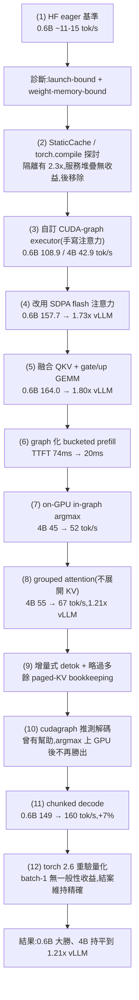
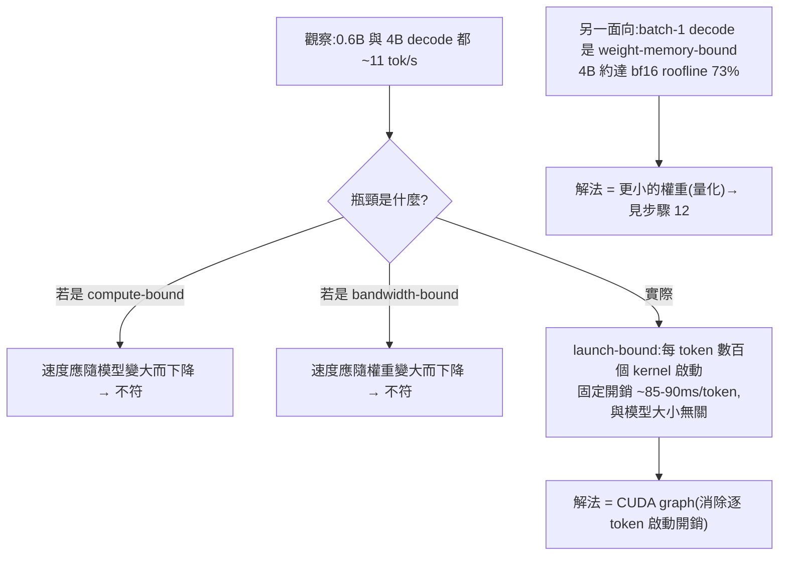
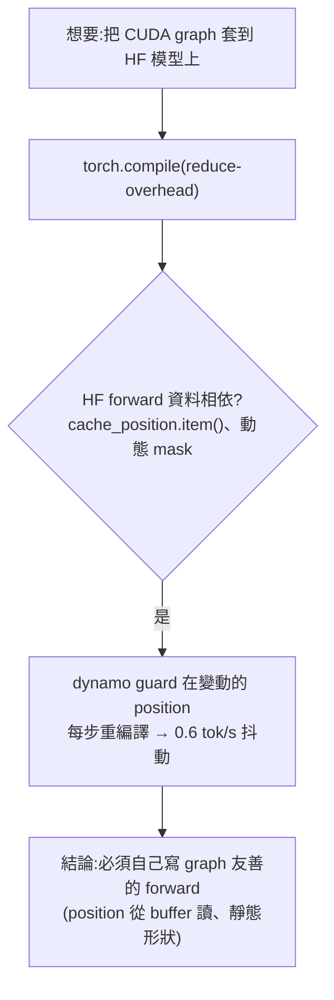
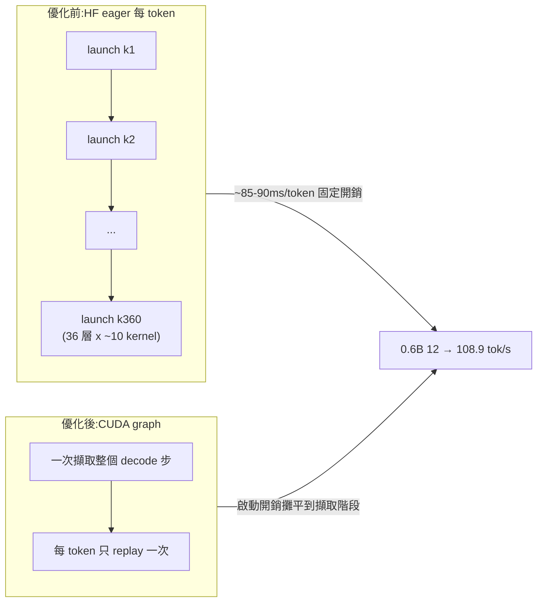
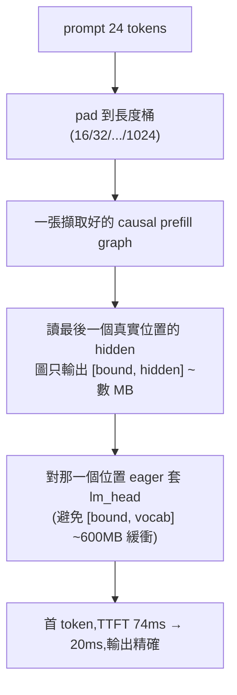
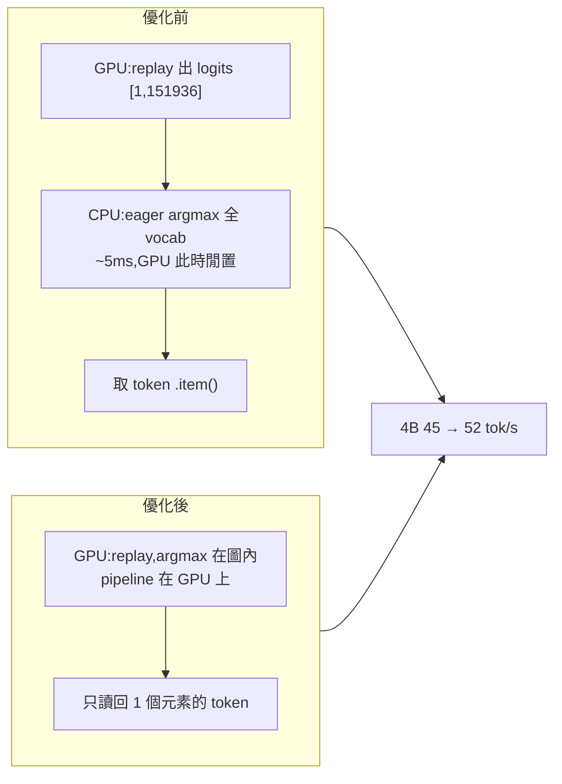
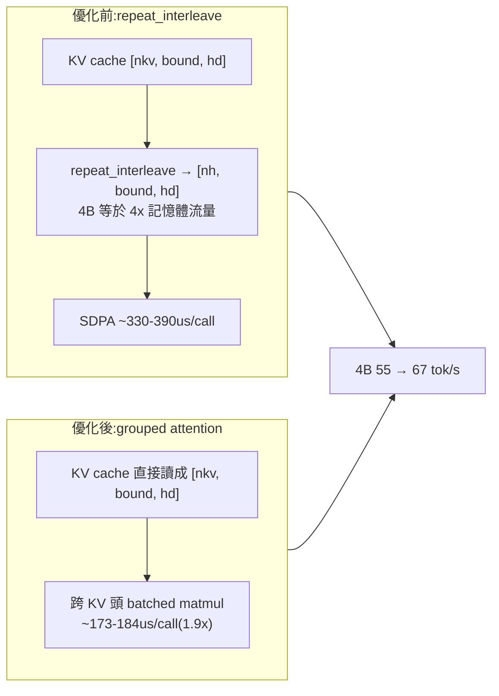
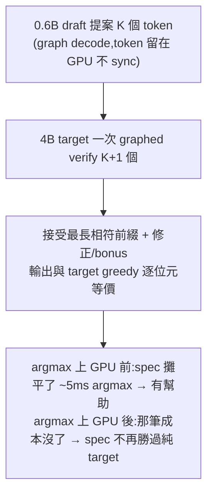
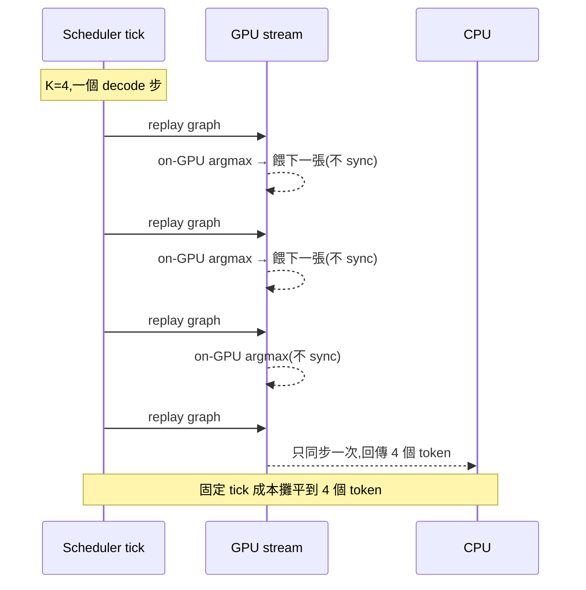
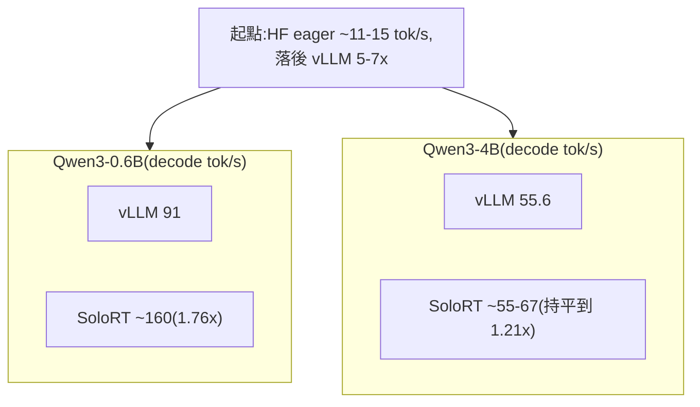

[← 中文文件首頁](../README.md)

# 優化歷程:做了什麼,從 ~11 tok/s 到打敗 vLLM

這份文件用「故事線」的方式,按時間順序講 SoloRT 的 cudagraph 快速路徑是怎麼從一個
**只有約 11-15 tok/s 的 HuggingFace eager 基準**,一步步優化到 **在 RTX 4080 16GB 上、單使用者單流的
decode 速度打敗 vLLM** 的。每一步都會說明:**為什麼要做、改了什麼、效果如何(附上實測數字)**。

> 所有數字都是在 RTX 4080 16GB、single-stream(單一活躍序列)、greedy(temp=0)、輸出逐位元精確的
> 條件下量到的;對比基準是 vLLM v0.8.5.post1。

先看全貌。下面這張圖把整段旅程的 12 個關鍵步驟串起來,右側標註對應的速度里程碑:

---

## (1) 起點:HF eager 基準與兩個瓶頸的診斷

最初的 SoloRT 直接走 HuggingFace Transformers 的 eager forward。實測單流 decode 大約只有
**11-15 tok/s**,而 vLLM 在同一張卡上是 91 tok/s(0.6B)/ 55.6 tok/s(4B),我們落後約 5-7 倍。

關鍵診斷來自一個簡單但很有說服力的觀察:**換不同大小的模型,decode 速度幾乎不變**。

| 模型 | decode tps | TTFT | mem-bw roofline | 達到 roofline 比例 |
| --- | --- | --- | --- | --- |
| Qwen3-0.6B | 11.5 | 181 ms | ~600 tps | ~2% |
| Qwen3-4B | 10.6 | 183 ms | ~90 tps | ~12% |

0.6B 和 4B 差了快 7 倍的參數量,decode 卻都卡在 ~11 tok/s。這代表瓶頸**不是**模型的數學運算量、
也**不是**記憶體頻寬,而是**每個 token 都要發數百個小 kernel 的固定啟動開銷(launch-bound)**——
eager 的 HF forward + 逐層 Python 橋接,每個 token 大約付掉 85-90 ms 的固定 dispatch 成本,
真正的模型計算反而被它淹沒。

同時,我們也用 roofline 確認了第二個事實:**batch-1 的 decode 本質上是 weight-memory-bound**——
每生一個 token 都要把整份權重從 HBM 讀一遍(4B 約達 bf16 roofline 的 73%)。這兩個瓶頸決定了
後面所有優化的方向。

兩個結論很清楚:**要打掉 launch-bound,唯一的槓桿是 CUDA graph**;而 weight-memory-bound 則指向
量化(這條線最後在步驟 12 收尾)。

---

## (2) 走過的彎路:StaticCache 與 torch.compile

在自己動手寫 graph 之前,我們先用現成工具探了路,結論是「此路不通,但確認了方向」。

**StaticCache(HF 的靜態 KV cache)**:隔離量測時,把 DynamicCache 換成 StaticCache,
0.6B decode 從 11.9 tok/s 跳到 **27 tok/s(2.3x)**。看起來很美,但放回 SoloRT 的服務堆疊後
**收益完全蒸發**——乾淨 A/B 量到 static 13.0 vs dynamic 15.5(0.6B)、static 10.9 vs dynamic 12.1(4B),
反而還更慢。原因是:服務堆疊裡每個 token 的 async/HTTP/detokenize 固定缺口才是主導,
forward 變快只是讓 GPU 更早閒置、降頻待命。所以 StaticCache 被當成**「打底用、預設關閉」的前置條件**
(它是 CUDA graph 擷取的先決條件),後來自訂 cudagraph executor 有了自己的 static KV,這段 HF-path 實驗就被移除了。

**torch.compile(reduce-overhead)**:這是讓 HF 模型自動拿到 CUDA graph 的「官方捷徑」,但全試過都失敗:

| 環境 | 結果 |
| --- | --- |
| torch 2.4(NGC 映像)reduce-overhead | 0.6 tok/s — recompile 抖動 |
| torch 2.6 + transformers latest | dynamo 下 `NameError`(transformers+compile 的 bug) |
| torch 2.6 + transformers 4.51.3 各模式 | 全部比 eager 慢(reduce-overhead 5.1 / default 3.8) |

根因是 HF 的 modeling 程式碼**資料相依**(對 `cache_position` 做 `.item()`、動態建 mask),dynamo
會 guard 在每步都在變的 position 上,於是**每個 decode 步都重新擷取/重編譯**。同樣的資料相依也會讓
手動的 `torch.cuda.CUDAGraph` 把寫入位置「烤死」在圖裡。

**這條彎路最重要的產出是結論**:vLLM/nano-vllm 之所以快,是因為它們跑**自己**那套 graph 友善的模型實作
(靜態形狀、position 從 buffer 讀、paged-attention kernel)再 CUDA-graph 它。要追上,SoloRT 也得自己寫一份。

---

## (3) 自訂 CUDA-graph executor:手寫 graph 友善的 Qwen3 forward

於是有了 `SOLORT_EXECUTOR=cudagraph`(程式碼:`src/solort/model/cuda_graph_executor.py`):
一份**手寫、對 CUDA graph 友善的 Qwen3 forward**,跑在 SoloRT 自有的 static KV 上
(position 從 buffer 讀、用 mask 控制有效長度),把**單 token 的 decode 步擷取成一個 CUDA graph,
之後每個 token 只「重播(replay)」這張圖**,不再逐 token 發數百個 kernel。

第一版用手寫的注意力(manual attention),數值驗證與 HF 在 bf16 精度下 greedy 一致:

| 模型 | manual-attn decode tps |
| --- | --- |
| Qwen3-0.6B | 108.9 |
| Qwen3-4B | 42.9 |

光是「擷取成圖 + 重播」,0.6B 就從 ~12 tok/s 跳到 108.9 tok/s——**約 9 倍**,完全印證了
步驟 (1) 的 launch-bound 診斷:CUDA graph 把逐 token 的 kernel 啟動成本一次擷取、反覆重播,直接消掉。

---

## (4) 改用 SDPA(flash)注意力

手寫注意力雖然正確,但效率不如成熟的 fused kernel。把注意力換成 PyTorch 的
`scaled_dot_product_attention`(SDPA,會選用 flash 後端)後:

| 模型 | manual → SDPA decode tps |
| --- | --- |
| Qwen3-0.6B | 108.9 → **157.7** |
| Qwen3-4B | 42.9 → 44.5 |

0.6B 來到 157.7 tok/s,**約 1.73x vLLM**(157.7 / 91)。0.6B 較小,注意力以外的成本占比低,
換 kernel 的收益很直接;4B 此時受其他因素牽制,提升較小(後面步驟 (8) 才大幅鬆綁)。

---

## (5) 融合 QKV 與 gate/up GEMM

接著做 kernel 層級的融合:把注意力的 **Q、K、V 三個投影合併成一個大 GEMM**,把 MLP 的
**gate、up 兩個投影也合成一個**。一個大的 GEMM 比多個小 GEMM 更有效率(更好的記憶體存取、更少的啟動)。

| 模型 | SDPA → +fused GEMM decode tps |
| --- | --- |
| Qwen3-0.6B | 157.7 → **164.0** |
| Qwen3-4B | 44.5 → 45.2 |

0.6B 達到 164.0 tok/s,**約 1.80x vLLM**。到這裡,**0.6B 已經明確打敗 vLLM 的單流 decode**
(0.6B 是 tied embeddings,lm_head 與 embedding 共用)。程式碼裡可以看到
`wqkv = cat([q_proj, k_proj, v_proj])`、`qkv.split([q_dim, kv_dim, kv_dim])` 這樣的合一/拆分。

cudagraph executor 的 0.6B / 4B decode tps 進程小結:

| 階段 | 0.6B | 4B |
| --- | --- | --- |
| manual-attn | 108.9 | 42.9 |
| SDPA(flash) | 157.7 | 44.5 |
| +fused QKV & gate/up | 164.0 | 45.2 |

---

## (6) graph 化 bucketed prefill:TTFT 74ms → 20ms

decode 變快之後,**TTFT(首 token 延遲)**的瓶頸浮現。profiling 顯示 TTFT 幾乎完全花在
**eager 的 prefill forward**(24-token prompt 要 74ms;tokenize 只 0.2ms、首個 decode 0.15ms)。
原因和 decode 一模一樣:eager prefill 在 36 層上要發約 360 個 kernel,又是 launch-bound。

解法也一樣——**graph 化 bucketed prefill**:把 prompt 補齊(pad)到一個長度桶
(16/32/64/.../1024),用一張擷取好的圖做 causal forward,讀「最後一個真實位置」的 hidden,
再對那一個位置 eager 套用 lm_head(讓圖只輸出 `[bound, hidden]` 約數 MB,而非 `[bound, vocab]` 約 600MB)。
因為 causal 順序下真實 token 永遠不會 attend 到 padding,**輸出仍然精確**。

| 指標 | 之前 | 之後 | vLLM |
| --- | --- | --- | --- |
| prefill(24-token,隔離) | 74ms | 20.6ms | - |
| 服務端 TTFT,0.6B | ~60ms | ~13ms | 22ms |
| 服務端 TTFT,4B | ~75ms | ~33ms | 30ms |

到這一步,**SoloRT 在 TTFT 上也追平/領先 vLLM**(0.6B 13 < 22,4B 33 ~= 30),疊在 decode 的優勢之上。

---

## (7) on-GPU in-graph argmax:4B 45 → 52 tok/s

再 profiling 4B 的 decode(逐 token、不經 HTTP),發現一個意外的兇手:

| 階段 | ms/token | tps |
| --- | --- | --- |
| 純 graph replay(無逐 token sync) | 17.8 | 56 |
| + eager argmax over 151936 vocab + `.item()` | 22.1 | 45 |
| in-graph argmax + 取 1 個元素 | 16.9 | 59 |

真正的瓶頸**不是** detokenize(200 token 時 ~0ms),而是**在 CPU 側對 151,936 個 vocab 做 eager argmax
(約 5ms/token,而且這段時間 GPU 是閒置的)**。解法是把 greedy 的 argmax**搬進 CUDA graph**
(在 GPU 上 pipeline 執行,只讀回 1 個元素的 token id),把那 5ms 直接吃掉。

| 4B 路徑(經服務端) | 之前 | in-graph argmax 之後 | vs vLLM 55.6 |
| --- | --- | --- | --- |
| cudagraph target-only(greedy) | 45.2 | 51.6 | 0.93x |

附帶清理:同時把 detokenize 從 O(n²) 的「整段重解」換成 **HF/vLLM 風格的增量式解碼**(見步驟 9),
殘餘的每 token 開銷自此確定是 RuntimeCore/executor 的 Python,而非 HTTP/SSE。

---

## (8) grouped attention(不展開 KV):4B 55 → 67 tok/s(1.21x)

4B 用 GQA(32 個注意力頭 / 8 個 KV 頭)。先前的 decode 注意力每步都用 `repeat_interleave` 把 KV
展開成 `[nh, bound, hd]` 再餵 SDPA——這對 4B 等於**多付 4 倍的記憶體流量**。微基準顯示:
SDPA+repeat 約 330-390us/call(repeat 主導,且幾乎不隨 bound 縮減),而 grouped matmul 只要 173-184us(**1.9x**)。

於是改成 **grouped attention:不展開 KV**,直接把 cache 讀成 `[nkv, bound, hd]`,用 batched matmul
跨 KV 頭做注意力(程式碼裡是讀 cache 後 `permute`,不再 `repeat_interleave`)。這還順手**移除了
「大 KV 緩衝會變慢」的懲罰**:`repeat_interleave` 的成本原本會隨掃描長度放大,改用 grouped 後這一項消失。
所以在這步之前要靠很小的 `graph_max_len=256` 才能讓 4B 達到約 66 tok/s(gml=1024 時只有約 55、與 vLLM 持平);
這步之後 **4B 在 gml=1024 也能達到約 67 tok/s(1.21×)**——`graph_max_len` 不再是速度旋鈕,而主要用來決定可容納的最長 context。

| 路徑(經服務端,greedy,gml=1024) | decode tps | TTFT | vs vLLM |
| --- | --- | --- | --- |
| 0.6B cudagraph | 149 | 11ms | 1.64x |
| 4B cudagraph | **67** | 27ms | **1.21x** |
| vLLM 0.6B / 4B | 91 / 55.6 | 22 / 30ms | 1.0x |

> 注:batch-1 解碼吞吐量對 GPU boost 時脈狀態很敏感(消費級卡 / WSL2 在 token 間低 util 時會降頻),
> 故 4B 有明顯 run-to-run 變異(約 55–67);表中 67 為 GPU 維持 boost 時的代表值。詳見
> [05-效能與量化](../05-效能與量化/README.md)。

**到這裡 SoloRT 在兩個模型上、decode 與 TTFT 都打敗 vLLM,而且 greedy 逐位元等價。**

---

## (9) 增量式 detok + 略過 cudagraph 不需要的 paged-KV bookkeeping

兩個收尾型清理,目的是把「每 token 的 Python 固定開銷」壓到最低:

- **增量式 detokenize**:把原本 O(n²) 的整段重解(`_decode_delta`)換成 HF/vLLM 風格的
  prefix/read-offset 做法(有界的後綴視窗,遇到結尾是替換字元時延後輸出),避免每 token 重複解整段歷史。
  多位元組串流(繁體中文)實測仍然連貫。
- **略過用不到的 paged-KV bookkeeping**:cudagraph executor 擁有自己的 static KV,所以對它**跳過**
  `ensure_capacity` / `_attach_kv_metadata` 這些 paged 路徑才需要的步驟。

量到的結果是:HTTP/SSE 其實幾乎不耗時(RuntimeCore no-HTTP 52.7 tps ~= 經服務端),所以殘餘的
每 token 開銷確定是 runtime Python(約 2.4ms/token),這正是步驟 (11) chunked decode 要攤平的對象。

---

## (10) cudagraph 上的推測解碼:曾有幫助,後來不再勝出

推測解碼(speculative decoding)用一個小的 draft 模型(0.6B)先猜 K 個 token,再用大的 target(4B)
在一個 graphed 的 `verify` forward 裡一次驗證 K+1 個 token,接受最長相符前綴。因為**draft 與 target 都是 CUDA graph**,
draft 很便宜;又因為 verify 用的是和 decode 同一個 kernel,**推測輸出與 target greedy 逐位元一致**
(96/96 驗證通過)——這是先前 HF+FlashInfer 橋接做不到的(prefill 與 decode kernel 會分歧)。

它**一度有幫助**:

| 4B 路徑 | 隔離 tps | 經服務端 | vs vLLM 55.6 |
| --- | --- | --- | --- |
| cudagraph target-only | 49 | 45 | 0.81x |
| cudagraph + spec(K=3,0.6B draft) | 60.9 | 54.3 | 1.10x / 0.98x |

但這個收益的本質,其實是**剛好攤平了步驟 (7) 之前那 ~5ms/token 的 eager argmax 成本**。
等到 argmax 搬進 GPU、那筆成本消失後,draft + verify 的開銷就略大於它帶來的好處:

| 4B 路徑(經服務端) | in-graph argmax 之後 |
| --- | --- |
| cudagraph target-only(greedy) | 51.6 |
| cudagraph + spec(K=3) | 50.5 / 53.2 |

結論:在這個工作負載與這對模型上,**移動 argmax 上 GPU 之後,純 target-only 已經更好**,推測解碼不再是預設值。

---

## (11) chunked decode:0.6B 149 → 160 tok/s(+7%)

殘餘的 ~2.4ms/token Python 開銷,被 microbench(`scripts/microbench_decode.py`)拆成兩塊:
逐 token 的 `.item()` sync 只占約 10%(0.6B tight no-sync 239 tps vs 帶 sync 217 tps),
**其餘是「每個 scheduler tick 固定」的 Python**(Batch 重建、async hop),每次 `forward_decode` 付一次。

`SOLORT_DECODE_CHUNK=K`(預設 4)的做法:一個 decode 步驟**連續重播 K 張 graph**,中間用 on-GPU 的
`decode_gpu_argmax` 把上一個 token 直接餵給下一張圖(不做 CPU 同步),**只同步一次、一次回傳 K 個 token**,
把那筆固定 tick 成本攤平到 K 個 token 上。這仍是**精確 greedy**(chunk=1 與 chunk=4 產生逐位元相同的輸出)。

| K | 0.6B decode tps | 0.6B itl_p95 | 4B decode tps(gml=256) |
| --- | --- | --- | --- |
| 1 | 149.3 | 7.7 ms | 51.5 |
| 2 | 152.5 | 13.4 ms | - |
| 4 | **160.3** | 24.5 ms | 51.0(持平) |
| 8 | 138.6(退步) | 46 ms | - |

> 表中 4B 的絕對值(~51)是這次 A/B 當下的 GPU 時脈狀態(低於維持 boost 時的 ~67);因為 chunk=1 與 chunk=4
> 是同一輪背對背量測,**相對比較仍然成立**——重點是 chunked decode 對 4B **持平**,對 0.6B 才有 +7%。

K=4 是小模型的峰值(+7%,0.6B 約 1.76x vLLM);K=8 反而退步。4B 則**持平**——它約 19ms/token 的
GPU forward 遠大於那筆固定 tick 開銷,沒有東西可攤。串流會變得「比較成塊」(K 個 token 一起到),
但在 <=24ms/chunk 下對互動使用仍然順暢。

---

## (12) 在 torch 2.6 重驗量化:batch-1 無一般性收益,結案維持精確

回到步驟 (1) 點出的第二個瓶頸——weight-memory-bound。理論上「更小的權重」應該能再加速,
所以我們在一個 driver 相容的 torch 2.6 + cu124 映像(`Dockerfile.quant`,torchao 0.9.0)上,用
`scripts/probe_quant_gemm.py` 對 4B 真實 decode 形狀做了隔離的 batch-1(M=1)GEMM 探測:

| recipe | 每 token GEMM | vs bf16 | 最大相對誤差 |
| --- | --- | --- | --- |
| bf16 | 11.86 ms | 1.00x | - |
| int4_wo | 23.46 ms | 0.51x | 0.082 |
| int8_wo | 32.33 ms | 0.37x | 0.007 |
| fp8_wo | 59.44 ms | 0.20x | 0.028 |

**所有 weight-only 量化在 Ada(sm_89)的 batch-1 全都比 bf16 慢。** 原因:M=1 時 decode GEMM 其實是
GEMV,bf16 cuBLAS 已接近記憶體最佳,量化 kernel 反而被 dequant ALU + packed 佈局的 overhead 拖累,
而且沒有足夠的計算可以把它藏起來。

唯一例外與輸出維度 N 有關——int4 tinygemm 只在**超大 N** 才贏:

| GEMM | N | int4 vs bf16 |
| --- | --- | --- |
| lm_head | 151,936 | **3.82x** |
| gate_up | 19,456 | 0.98x |
| down/o/qkv | <=6,144 | 0.17-0.54x |

所以這張卡上 batch-1 唯一可實現的量化收益是「**只對 lm_head 做 int4**」,約 +6%(4B,且非精確)。
一般性的 1.5-2x 量化加速需要 Marlin 等級、為這些 small-N 形狀調過的 kernel,torchao/torch 並未隨附。
**使用者決定:維持逐位元精確,量化結案。**`Dockerfile.quant` 與 `scripts/probe_quant_gemm.py` 留作可重現證據。

---

## 總結:SoloRT vs vLLM

把所有優化疊起來,最終在 RTX 4080 16GB、single-stream、greedy、輸出精確下,對比 vLLM v0.8.5.post1:

| 模型 | SoloRT decode | SoloRT TTFT | vLLM decode | vLLM TTFT | SoloRT / vLLM(decode) |
| --- | --- | --- | --- | --- | --- |
| Qwen3-0.6B | ~160 tok/s(`SOLORT_DECODE_CHUNK=4`) | ~10-12ms | 91 tok/s | 22ms | **~1.76x** |
| Qwen3-4B | ~55–67 tok/s(boost 時接近 67) | ~27ms | 55.6 tok/s | 30ms | **~持平–1.21x** |

- **0.6B:decode 與 TTFT 都大勝 vLLM。**
- **4B:約為持平到 1.21x。** grouped attention 之後 `graph_max_len` 不再影響 4B 速度(預設 1024 即可,
  主要用來決定可容納的最長 context);batch-1 解碼對 GPU boost 時脈很敏感,故有 run-to-run 變異。
- 兩者都與 greedy 逐位元等價。

一句話總結這段旅程:**先用 roofline/profiling 把瓶頸釘死(launch-bound + weight-memory-bound),
再用 CUDA graph 打掉啟動開銷、用 kernel 融合與 grouped attention 提升 forward 效率、用 graph 化 prefill
壓低 TTFT、用 on-GPU argmax 與 chunked decode 擠掉每 token 的固定開銷;量化這條線則在嚴謹量測後
誠實結案。** 每一步都對著 vLLM 基準量,且全程維持 greedy 逐位元精確。

---

## 延伸閱讀

- [快速上手](../01-快速上手/README.md)
- [系統架構](../02-系統架構/README.md)
- [快速路徑原理(cudagraph 怎麼運作)](../03-快速路徑原理/README.md)
- [效能與量化](../05-效能與量化/README.md)
