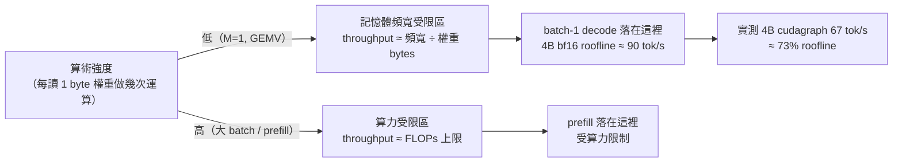
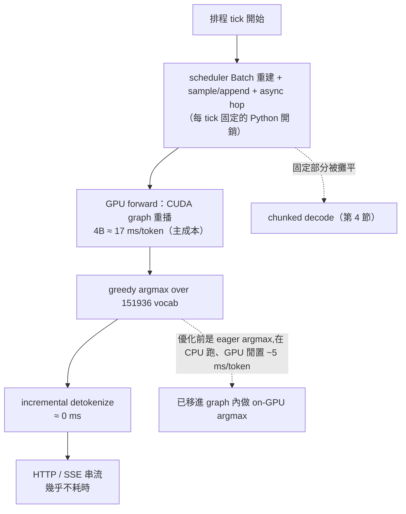
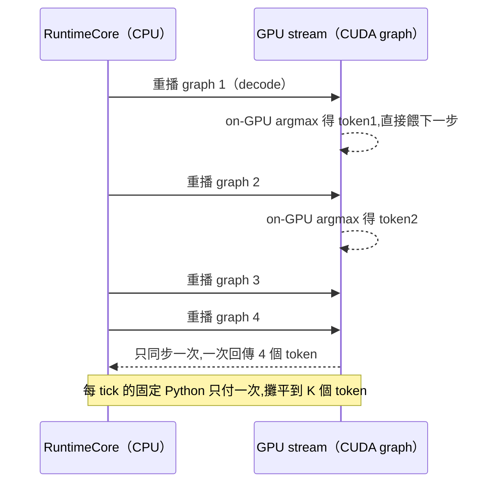
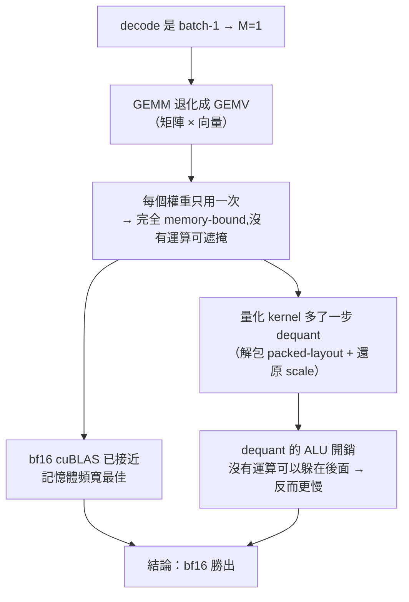
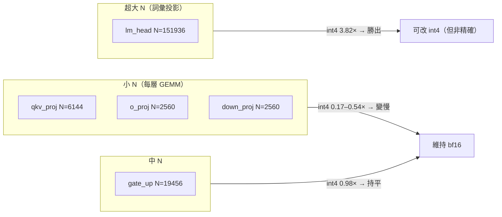

[← 中文文件首頁](../README.md)

# 效能解析與量化探討

這份文件回答兩個問題:

1. **SoloRT 的 decode 速度到底被什麼擋住?** —— 用 roofline 與 profiling 一層一層拆給你看。
2. **既然瓶頸是「讀權重的頻寬」,那把權重量化變小不就好了?** —— 我們真的試了,結論是「在這張卡、這個工作負載上行不通」,本文說明為什麼。

整份文件鎖定 **single-user、single-GPU、batch-1、greedy、逐位元精確** 這個 SoloRT 的目標工作負載
(RTX 4080 16GB、對比 vLLM v0.8.5.post1)。所有數字都來自 [`records.md`](../../../records.md) 與
[`docs/devlog.md`](../../devlog.md) 的實測,不是推估。

---

## 1. 先建立直覺:batch-1 decode 在做什麼

LLM 推論分兩個階段:

- **Prefill**:一次把整段 prompt 餵進去,所有 token 平行算。
- **Decode**:一次只產生一個 token,然後把它接回去再算下一個。互動式 chat 絕大多數時間都在 decode。

關鍵差別在於 **算術強度(arithmetic intensity)**:每從記憶體讀進 1 byte 的權重,能做幾次浮點運算。

- Prefill / 大 batch:同一份權重被很多個 token 重用 → 算術強度高 → 卡在**算力**。
- batch-1 decode:M(同時處理的 token 數)= 1,矩陣乘法 `x @ W.T` 退化成**矩陣乘向量(GEMV)**。
  每個權重元素只被用「一次」就丟掉 → 算術強度極低 → 卡在**把權重從 VRAM 搬出來的頻寬**。

所以 batch-1 decode 的速度上限,本質上是:

> 每秒能產生幾個 token ≈ 記憶體頻寬 ÷ (每個 token 要讀的權重 bytes)

模型越大、每 token 要讀的權重越多 → token/s 越低。這就是「weight-memory-bound」。

---

## 2. Roofline:batch-1 decode 是 weight-memory-bound

把上面的直覺畫成標準的 roofline 圖:橫軸是算術強度,有兩道天花板——一道是記憶體頻寬、一道是算力。
工作負載落在哪道天花板下面,就被那一項限制住。

roofline 的「記憶體天花板」可以直接算:用 GPU 的記憶體頻寬除以模型權重的 bytes。對照實測:

| 模型 | bf16 記憶體頻寬 roofline | eager HF 時代實測 | cudagraph 實測 | 佔 roofline |
| ---- | ----------------------- | ----------------- | -------------- | ----------- |
| Qwen3-0.6B | ~600 tok/s | ~11.5 tok/s | 160 tok/s | ~27% |
| Qwen3-4B   | ~90 tok/s  | ~10.6 tok/s | 67 tok/s  | **~73%** |

兩個重點:

- **eager 時代(~11 tok/s)離 roofline 非常遠**,而且 0.6B 與 4B 的 decode 速度幾乎一樣
  (~11 tok/s,模型差 7 倍卻同速)。這代表那時候根本不是被頻寬擋住,而是被**每 token 上百次 kernel 啟動**
  的固定開銷擋住(launch-bound)。這就是為什麼要做 CUDA graph:把整個 forward 擷取成一張圖、重播,
  消掉 kernel 啟動成本。詳見 [快速路徑原理](../03-快速路徑原理/README.md)。
- **加了 CUDA graph 之後,4B 直接逼到 roofline 的 73%**。這時候它「真的」是被權重讀取頻寬限制了——
  代表 GPU 端的實作已經接近這張卡在 bf16 下的物理極限,要再快只能「讓每 token 要讀的權重變少」
  (也就是量化,見第 5 節),不是再調 kernel。
- **0.6B 只到 27%**:小模型每 token 的 GPU 工作太少,反而換成被「每步固定的 Python/排程開銷」拖住——
  這正是第 4 節 chunked decode 能幫到小模型、卻幫不到 4B 的原因。

> ⚠️ **量測注意:batch-1 解碼對 GPU boost 時脈高度敏感。** 因為 batch-1 解碼是記憶體頻寬受限、算力利用率低,
> GPU 在 token 之間容易**降頻**(消費級卡 / WSL2 尤其明顯:本機曾觀察到 SM 時脈在 boost 3165MHz 與 idle 210MHz
> 之間擺盪)。這會造成顯著的 run-to-run 變異——4B 在維持 boost 時約 67 tok/s(≈1.21× vLLM、73% roofline),
> 降頻時可掉到 30–50 tok/s。表中數字皆為 GPU 維持 boost 時的代表值;要量到代表值,請先用連續生成暖機、
> 並避免同時有其他 GPU 工作(包含桌面 GUI)。vLLM 量測時面對同樣的物理限制。

---

## 3. Profiling 拆解:每 token 的時間花在哪

知道「理論上被頻寬擋住」還不夠,要實際 profile 看時間真的花在哪。下圖是一個 token 從排程到吐字的流水線,
標出每一段的成本,以及我們對它做了什麼:

實測拆解(4B,in-process、不經 HTTP,逐 token 計時,來自 `records.md`):

| 階段 | ms/token | 等效 tps |
| ---- | -------- | -------- |
| 純 graph 重播(無 per-token sync) | 17.8 | 56 |
| + eager argmax over 151936 vocab + `.item()` | 22.1 | 45 |
| in-graph argmax + 只取 1 個元素 | **16.9** | **59** |

讀法:

- **最大的單一浪費曾經是 eager argmax**:對 151,936 個詞彙做 argmax/`.float()`,而且是在 CPU 端跑、
  此時 GPU 閒著,白白吃掉 ~5 ms/token。把 greedy argmax **搬進 CUDA graph 內(on-GPU)**、只回傳 1 個 token id 後,
  這 5 ms 直接消失(22.1 → 16.9 ms)。
- **detokenize ≈ 0 ms**:改用 HF/vLLM 風格的增量式解碼(維護 prefix / read offset),不再每 token 重解整串,
  避免 O(n²)。在 200 token 規模下幾乎不計成本。
- **HTTP / SSE 幾乎不耗時**:RuntimeCore 不經 HTTP 量到的 tps,和經過完整 server 的 tps 幾乎一樣
  → 殘餘開銷不是網路層。
- **殘餘 ~2.4 ms/token 是 RuntimeCore/executor 的 Python**:scheduler 的 Batch 重建、sample/append、
  async hop。`scripts/microbench_decode.py` 進一步拆出:per-token 的 `.item()` 同步只佔 ~10%
  (0.6B runner 上限 ~239 tps 無同步 vs 217 tps 有每 token 同步),其餘是**每排程 tick 固定一次**的 Python,
  跟你一步吐幾個 token 無關。這個「每 tick 固定」的部分,正好可以用 chunked decode 攤平。

---

## 4. Chunked decode:把固定 tick 開銷攤平

既然「每排程 tick 的 Python 開銷」是固定一次、與吐出 token 數無關,那就讓**一個 decode 步驟連續吐 K 個 token**,
把這份固定成本除以 K。這就是 `SOLORT_DECODE_CHUNK`(cudagraph 路徑、greedy 專用,預設 K=4)。

機制是:一個 decode 步驟把 K 張 graph 背對背重播在同一條 GPU stream 上,中間用 **on-GPU 的 in-graph argmax**
(`decode_gpu_argmax`)把上一步的 token 直接餵給下一步,**完全不回 CPU 同步**,最後只同步一次、一次回傳 K 個 token。

因為 argmax 用的是 graph 內同一個 op,**chunk=1 與 chunk=4 產生逐位元相同的輸出**
(0.6B 115/115 字元、4B 177/177 完全一致),所以仍是精確 greedy。

A/B 實測(經過 server,warmup 2、runs 5、200 tokens):

| K | 0.6B decode tps | 0.6B itl_p95 | 4B decode tps(gml=256) |
| - | --------------- | ------------ | ----------------------- |
| 1 | 149.3 | 7.7 ms | 51.5 |
| 2 | 152.5 | 13.4 ms | — |
| 4 | **160.3(峰值)** | 24.5 ms | 51.0(持平) |
| 8 | 138.6(退步) | 46 ms | — |

讀法:

- **K=4 是 0.6B 的峰值**:149 → 160 tok/s(+7%),把 0.6B 從 ~1.64× 推到 ~1.76× vLLM。
- **K=8 反而退步**:攤平的邊際效益遞減,而代價(每個 chunk 要等 K token 都算完才一起送出)讓 itl_p95 一路升到 46 ms,
  互動體感變差。所以 K 太大不划算,預設停在 4。
- **4B 持平**:這是重點——4B 每 token 的 GPU forward 約 17–19 ms,**遠大於**那點固定 tick 開銷,
  沒有東西可攤平,所以 K 怎麼調都沒差。

為什麼**只有小模型有感**?把第 2 節和第 3 節接起來就懂了:固定 tick 開銷是「絕對值固定」的一塊。
4B 的 GPU forward 很大,這塊佔比小、攤平無感;0.6B 的 forward 很小(它離 roofline 還有 73% 的空間),
這塊佔比大,攤平就明顯。換句話說,chunked decode 是在補「0.6B 不是被頻寬、而是被固定 Python 擋住」的那一段。

---

## 5. 量化探討:為什麼這裡行不通

第 2 節說 4B 已達 bf16 roofline 的 73%,要再快只剩一條路:**讓每 token 要讀的權重 bytes 變少**——
也就是把權重從 bf16(16-bit)量化成 int8 / int4 / fp8。理論上 int4 只有 1/4 的 bytes,頻寬省 4 倍,
看起來是最後一根大槓桿。我們把它徹底驗證了一遍。

### 5.1 量測設定

在 `Dockerfile.quant`(`pytorch/pytorch:2.6.0-cuda12.4-cudnn9-devel` + torchao 0.9.0)上重驗——
選 cu124 runtime 是因為它對本機 12.6 / 560.94 driver 安全(NGC 25.x 的 CUDA 12.8 會要求 driver 570+)。
用 `scripts/probe_quant_gemm.py`,對 **4B 真實 decode 的每一個 GEMM 形狀**做 batch-1(M=1)探測,
量「每 token 把所有層 GEMM 加總」的延遲(RTX 4080 / sm_89)。

### 5.2 為什麼量化在 M=1 反而更慢

每 token GEMM 總延遲(全層加總):

| recipe | per-token GEMM | vs bf16 | max rel err |
| ------ | -------------- | ------- | ----------- |
| bf16 | 11.86 ms | 1.00× | — |
| int4_wo | 23.46 ms | **0.51×** | 0.082 |
| int8_wo | 32.33 ms | **0.37×** | 0.007 |
| fp8_wo | 59.44 ms | **0.20×** | 0.028 |

**三種 weight-only 量化整體全都比 bf16 慢。** 原因如上圖:M=1 時 decode GEMM 其實是 GEMV,
bf16 cuBLAS 已經逼近記憶體頻寬最佳;量化 kernel 要先 dequant(解包 + 還原 scale),這些 ALU 開銷
在 batch-1 沒有大量運算可以遮掩,反而拖慢。torch 2.6 沒有改變 torch 2.4 時得到的同一結論。

### 5.3 唯一的例外:超大 N 的 lm_head

例外與輸出維度 **N** 有關。int4 tinygemm(`_weight_int4pack_mm`,gpt-fast 那顆低 batch kernel)
只有在 N 非常大時才贏得過 bf16:

| GEMM | N(輸出維度) | K(輸入維度) | int4 vs bf16 |
| ---- | ----------- | ----------- | ------------ |
| lm_head | 151,936 | 2,560 | **3.82×** |
| gate_up | 19,456 | 2,560 | 0.98×(持平) |
| qkv_proj / o_proj / down_proj | ≤ 6,144 | — | 0.17–0.54×(變慢) |

所以這張卡在 batch-1 唯一能落地的量化,只有 **對 lm_head 單獨做 int4**:該 GEMM 從 1.46 ms → 0.38 ms
(省 ~1.08 ms/token,約 4B decode 的 **+6%**)。代價是**不再逐位元精確**:logit 誤差約 7%,
變成近似 greedy。每一層的 GEMM 都太「小 N」,任何低 batch 量化 kernel 都贏不了 cuBLAS bf16。

### 5.4 結論:維持精確、量化結案

要拿到一般性的 1.5–2× 量化加速,需要 **Marlin 等級、針對這些 small-N 形狀調過的 kernel**,
而 torchao / torch 並沒有附這種東西。在 Ada(sm_89)、batch-1、現有軟體上,沒有「又快又能用」的量化路徑。

因此使用者的決定是:**維持逐位元精確、量化結案。** `Dockerfile.quant` 與 `scripts/probe_quant_gemm.py`
保留下來,作為可重現的證據。

> 一句話總結:已經貼著 bf16 roofline(4B ~73%)且逐位元精確的 SoloRT,在這張卡上就是實務最佳解;
> 唯一還能榨的 lm_head int4(+6%)要犧牲精確性,不值得。

---

## 6. 把整條故事串起來

| 瓶頸 | 影響誰 | 怎麼診斷出來 | 對策 |
| ---- | ------ | ------------ | ---- |
| kernel 啟動開銷(launch-bound) | 兩個模型 | eager 時代 0.6B/4B 同速 ~11 tps | CUDA graph 擷取重播 |
| eager argmax over 151936 vocab(~5 ms) | 兩個模型 | 逐 token profiling(22.1 → 16.9 ms) | argmax 移進 graph(on-GPU) |
| 每排程 tick 固定 Python(~固定一塊) | 主要是 0.6B | microbench:sync 只佔 ~10% | chunked decode(K=4,+7%) |
| 權重讀取頻寬(weight-memory-bound) | 主要是 4B | 4B 達 bf16 roofline 73% | 量化(已驗證:在這張卡行不通) |

decode 的故事就是「一層一層剝掉非物理的開銷,直到撞上 bf16 的記憶體頻寬天花板」。撞上天花板之後,
唯一的物理槓桿(量化)在這個硬體 / 軟體組合的 batch-1 上不成立,所以結案在「精確 + 貼著 roofline」。

---

## 延伸閱讀

- [快速路徑原理](../03-快速路徑原理/README.md) —— CUDA graph、bucketed 擷取、on-GPU argmax、融合 GEMM 怎麼把 launch-bound 解掉。
- [優化歷程](../04-優化歷程/README.md) —— 從 eager ~11 tps 一路到勝過 vLLM 的每一步實測與決策。
- [系統架構](../02-系統架構/README.md) —— RuntimeCore / scheduler / executor 的資料流(profiling 裡那 ~2.4 ms Python 的來源)。
- [快速上手](../01-快速上手/README.md) —— 怎麼啟動 server、跑 benchmark、用 `SOLORT_DECODE_CHUNK` 重現本文數字。
