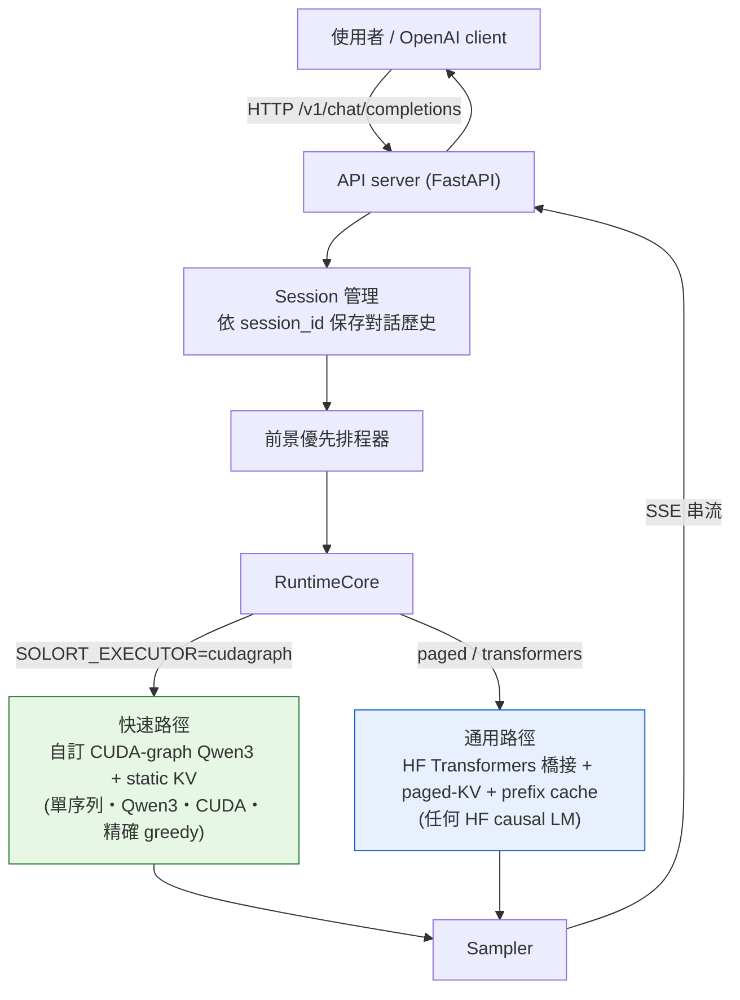

# SoloRT 中文文件

> [English README](../../README.md) · [繁體中文 README](../../README.zh-TW.md) · [英文技術文件 docs/architecture.md](../architecture.md)

**SoloRT** 是一套針對消費級 NVIDIA GPU 的「單使用者、單 GPU」LLM 推論執行環境 —— 為單一互動工作階段
(chat / code / RAG / agent)調校,在這個工作負載上比 vLLM 更快,並提供 OpenAI 相容 API。

這套中文文件把「怎麼用、怎麼運作、做了什麼、為什麼這樣設計」拆成數個主題,放在不同子目錄下,並用大量
示意圖輔助理解。**第一次接觸,建議從 [01-快速上手](01-快速上手/README.md) 開始。**

## 全貌

## 效能一覽(RTX 4080 16GB,single-stream,greedy,輸出精確,對比 vLLM v0.8.5)

| 模型 | SoloRT 解碼 | vLLM 解碼 | SoloRT TTFT | vLLM TTFT |
| ---- | ----------- | --------- | ----------- | --------- |
| Qwen3-0.6B | ~160 tok/s(**1.76×**) | 91 tok/s | ~10–12 ms(**勝**) | 22 ms |
| Qwen3-4B | ~55–67 tok/s(**持平–1.21×**) | 55.6 tok/s | ~27 ms(**勝**) | 30 ms |

> 註:4B 的 batch-1 解碼吞吐量對 GPU boost 時脈狀態敏感(消費級卡 / WSL2 在 token 間低 util 時會降頻),
> 故有 run-to-run 變異;~67 為維持 boost 時的代表值。詳見 [05-效能與量化](05-效能與量化/README.md)。

> 從 ~11 tok/s 的 HuggingFace eager 基準一路優化而來,輸出與 greedy 逐位元等價。詳見
> [04-優化歷程](04-優化歷程/README.md)。

## 文件導覽

| 章節 | 內容 |
| ---- | ---- |
| [01 快速上手](01-快速上手/README.md) | **end-to-end 教學**:從建置映像、啟動伺服器,到用 `scripts/chat.py` 多輪互動對話、跑 benchmark。新手從這裡開始。 |
| [02 系統架構](02-系統架構/README.md) | 兩條執行路徑、從請求到 SSE 的元件鏈、前景優先排程、Session 歷史、paged-KV 佈局。 |
| [03 快速路徑原理](03-快速路徑原理/README.md) | cudagraph 為何快:CUDA graph 擷取/重播、長度分桶、on-GPU argmax、grouped attention、融合 GEMM、chunked decode。 |
| [04 優化歷程](04-優化歷程/README.md) | **做了什麼**:從 ~11 tok/s 到打敗 vLLM 的每一步優化、原因與數據。 |
| [05 效能與量化](05-效能與量化/README.md) | roofline、profiling 拆解、chunked decode 量測,以及量化為何在此 batch-1 行不通的完整探討。 |

## 名詞速查

- **cudagraph / 快速路徑**:手寫、對 CUDA graph 友善的 Qwen3 forward,跑在 SoloRT 自有的 static KV 上;單流勝過 vLLM。
- **paged / 通用路徑**:HF Transformers 橋接 + paged-KV metadata + prefix cache,適用任何 HF causal LM。
- **TTFT**:Time To First Token,首字延遲。
- **decode tok/s**:穩態每秒解碼 token 數(吞吐量)。
- **bf16 roofline**:在 bf16 權重下,受記憶體頻寬限制的理論上限。

---

🤖 本文件集由 [Claude Code](https://claude.com/claude-code) 協助產生。
